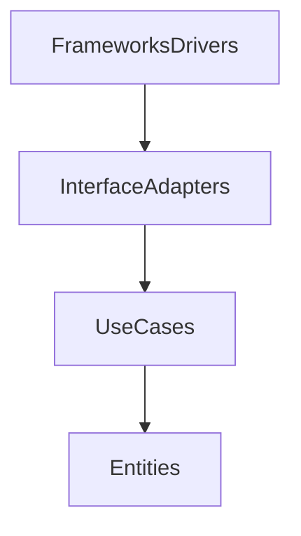

# Clean Architecture

## Capas
- **Entities:** Negocio puro, reglas y lógica del dominio.
- **Use Cases:** Casos de uso de la aplicación, orquestan la lógica de negocio.
- **Interface Adapters:** Adaptan datos entre el dominio y el mundo exterior (controladores, gateways, presenters, etc).
- **Frameworks & Drivers:** Infraestructura, frameworks, bases de datos, UI, etc.

## Regla de oro
> Las dependencias siempre apuntan hacia el dominio

## Ventajas
- Testeable
- Escalable
- Framework-agnostic (no dependes de frameworks)

## Diagrama visual

---

## ¿Por qué usarla?
- Permite que el dominio sea independiente de detalles externos.
- Facilita el testing y el mantenimiento.
- Hace posible cambiar frameworks o tecnologías sin afectar la lógica de negocio.
