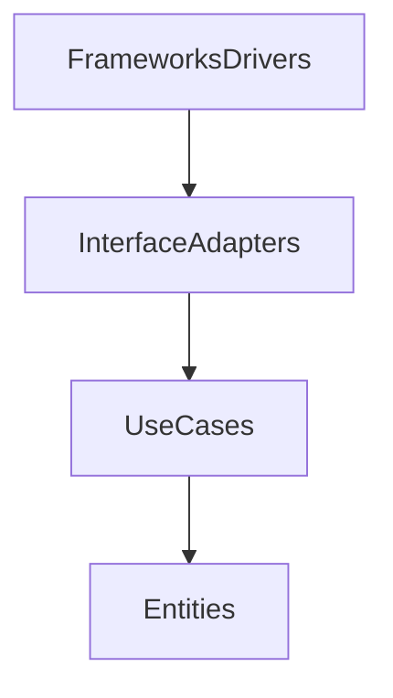

# Clean Architecture

## Capas
- **Entities:** Negocio puro, reglas y lógica del dominio.
- **Use Cases:** Casos de uso de la aplicación, orquestan la lógica de negocio.
- **Interface Adapters:** Adaptan datos entre el dominio y el mundo exterior (controladores, gateways, presenters, etc).
- **Frameworks & Drivers:** Infraestructura, frameworks, bases de datos, UI, etc.

## Regla de oro
> Las dependencias siempre apuntan hacia el dominio

## Ventajas
- Testeable
- Escalable
- Framework-agnostic (no dependes de frameworks)

## Diagrama visual


---

## Ejemplo mínimo en TypeScript

Supongamos un caso de uso de transferencia bancaria:

### Entities (Dominio puro)
```typescript
// entities/Account.ts
export class Account {
  constructor(public id: string, public balance: number) {}
  debit(amount: number) { this.balance -= amount; }
  credit(amount: number) { this.balance += amount; }
}
```

### Use Cases
```typescript
// usecases/Transfer.ts
import { Account } from '../entities/Account';
export class Transfer {
  execute(from: Account, to: Account, amount: number) {
    from.debit(amount);
    to.credit(amount);
  }
}
```

### Interface Adapters
```typescript
// adapters/TransferController.ts
import { Transfer } from '../usecases/Transfer';
import { Account } from '../entities/Account';
export class TransferController {
  transfer(fromId: string, toId: string, amount: number) {
    // Simulación: obtención de cuentas
    const from = new Account(fromId, 100);
    const to = new Account(toId, 50);
    new Transfer().execute(from, to, amount);
    return { from, to };
  }
}
```

### Frameworks & Drivers
```typescript
// frameworks/server.ts
import { TransferController } from '../adapters/TransferController';
const controller = new TransferController();
console.log(controller.transfer('A', 'B', 10));
```
