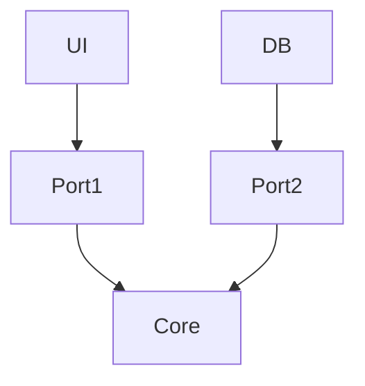

# Hexagonal Architecture (Ports & Adapters)

## Esquema
```
[ UI ] → Port → Core ← Port ← DB
```

## ¿En qué consiste?
- El núcleo de la aplicación (Core) está rodeado de "puertos" (interfaces) y "adaptadores" (implementaciones concretas).
- Usas **interfaces como contratos** para comunicarte con el core.

## Ideal para:
- APIs
- Microservicios
- Testing avanzado

## Ventajas
- Facilita el testing y el reemplazo de componentes externos.
- El core no depende de detalles externos.
- Muy útil para aplicaciones desacopladas y escalables.

---

## Diagrama visual

