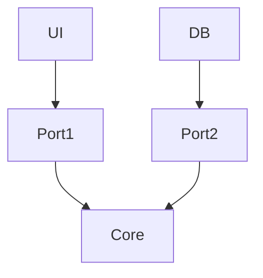

# Hexagonal Architecture (Ports & Adapters)

## Esquema
```
[ UI ] → Port → Core ← Port ← DB
```

## ¿En qué consiste?
- El núcleo de la aplicación (Core) está rodeado de "puertos" (interfaces) y "adaptadores" (implementaciones concretas).
- Usas **interfaces como contratos** para comunicarte con el core.

## Ideal para:
- APIs
- Microservicios
- Testing avanzado

## Ventajas
- Facilita el testing y el reemplazo de componentes externos.
- El core no depende de detalles externos.
- Muy útil para aplicaciones desacopladas y escalables.

---

## Diagrama visual


---

## Ejemplo mínimo en TypeScript

### Core (Dominio)
```typescript
// core/Greeter.ts
export interface Greeter {
  greet(name: string): string;
}

export class GreeterService implements Greeter {
  greet(name: string) { return `Hola, ${name}`; }
}
```

### Port (Interfaz)
```typescript
// ports/GreeterPort.ts
import { Greeter } from '../core/Greeter';
export interface GreeterPort {
  greetUser(name: string): string;
}
```

### Adapter (Implementación)
```typescript
// adapters/GreeterAdapter.ts
import { GreeterService } from '../core/Greeter';
import { GreeterPort } from '../ports/GreeterPort';
export class GreeterAdapter implements GreeterPort {
  private greeter = new GreeterService();
  greetUser(name: string) {
    return this.greeter.greet(name);
  }
}
```

### UI o Driver
```typescript
// ui/app.ts
import { GreeterAdapter } from '../adapters/GreeterAdapter';
const greeter = new GreeterAdapter();
console.log(greeter.greetUser('Mundo'));
```
