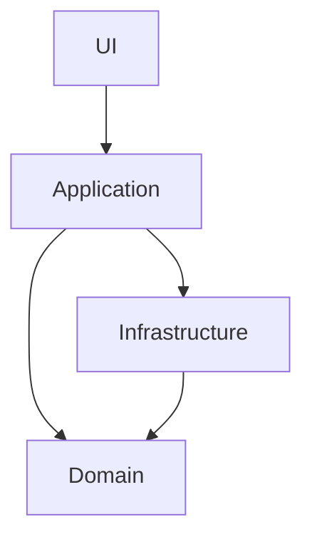

# Arquitectura en Capas (Layered Architecture)

La arquitectura en capas es un patrón clásico de organización de software que separa la aplicación en capas bien definidas, cada una con responsabilidades claras.

## Capas típicas

```
UI
Application
Domain
Infrastructure
```

### Descripción de cada capa

- **UI (User Interface):** Interfaz de usuario, responsable de la interacción con el usuario. No accede directamente a la base de datos ni a detalles de infraestructura.
- **Application:** Orquesta los casos de uso y la lógica de aplicación. Coordina el flujo entre UI y Domain.
- **Domain:** Contiene la lógica de negocio pura y las reglas del dominio. No depende de frameworks ni de detalles de infraestructura.
- **Infrastructure:** Implementa detalles técnicos como acceso a base de datos, servicios externos, frameworks, etc. Es reemplazable y no debe afectar la lógica de negocio.

## Reglas clave

- **UI no habla con DB:** La interfaz de usuario nunca accede directamente a la base de datos ni a la infraestructura.
- **Domain no depende de frameworks:** El dominio es puro y no tiene dependencias con frameworks o tecnologías externas.
- **Infrastructure es reemplazable:** Puedes cambiar la infraestructura (por ejemplo, cambiar de base de datos) sin afectar el dominio ni la lógica de aplicación.

---

## Relación con Clean Architecture

La arquitectura en capas es la base de la Clean Architecture, que refuerza la separación de responsabilidades y la independencia del dominio respecto a detalles externos.

---

## Ejemplo visual



---

## ¿Por qué usarla?
- Facilita el mantenimiento y la escalabilidad.
- Permite pruebas más sencillas.
- Hace posible reemplazar tecnologías sin reescribir la lógica de negocio.

---

## Ejemplo mínimo en TypeScript

Supongamos una app de tareas:

### UI
```typescript
// ui/App.ts
import { TaskService } from '../application/TaskService';
const service = new TaskService();
console.log(service.getTasks());
```

### Application
```typescript
// application/TaskService.ts
import { TaskRepository } from '../infrastructure/TaskRepository';
export class TaskService {
  private repo = new TaskRepository();
  getTasks() { return this.repo.findAll(); }
}
```

### Domain
```typescript
// domain/Task.ts
export class Task {
  constructor(public id: number, public title: string) {}
}
```

### Infrastructure
```typescript
// infrastructure/TaskRepository.ts
import { Task } from '../domain/Task';
export class TaskRepository {
  findAll() { return [new Task(1, 'Aprender SOLID')]; }
}
```
