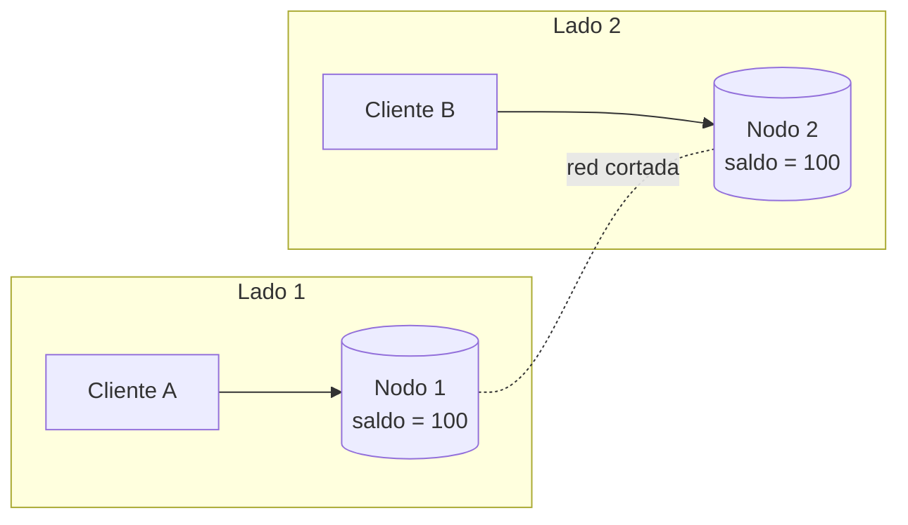

# Teorema CAP, PACELC y modelos de consistencia

## Qué dice realmente CAP
Formulado por Eric Brewer (2000) y demostrado por Gilbert y Lynch (2002). La versión correcta:

> En un sistema distribuido con datos replicados, **cuando ocurre una partición de red** debes elegir entre **Consistencia** (linearizabilidad) y **Disponibilidad**.

- **C – Consistency**: **linearizabilidad**. Todas las operaciones parecen ocurrir de forma atómica en un único punto del tiempo entre su inicio y su fin; una lectura que empieza después de que una escritura terminó **debe** ver esa escritura (o una posterior). Es como si hubiera una sola copia del dato.
- **A – Availability**: todo request recibido por un nodo **que no ha fallado** obtiene una respuesta **sin error** (no vale responder "no disponible"). Es una definición mucho más estricta que "uptime del 99,9%".
- **P – Partition tolerance**: el sistema sigue operando aunque la red pierda o retrase arbitrariamente mensajes entre nodos.

### Por qué "CA" no es una opción real
- En un sistema distribuido **las particiones no se eligen, ocurren** (switch caído, GC pause larga, cable, zona de nube aislada). P no es opcional.
- Por lo tanto la elección real es: **durante una partición, ¿CP o AP?**
- Un Postgres de un solo nodo es "CA" solo en el sentido trivial de que no es distribuido: si el nodo cae, no está disponible. No es una categoría útil.
- Fuera de una partición, un sistema puede ofrecer C **y** A a la vez. CAP no dice nada sobre la operación normal (para eso está PACELC).

### Qué pasa en una partición

El cliente A escribe `saldo = 50` en el Nodo 1. El cliente B lee en el Nodo 2. El Nodo 2 no puede saber si hubo escrituras.
- **Elige CP**: el Nodo 2 (o el lado minoritario) **rechaza** o deja colgado el request (error/timeout). Consistente, no disponible.
- **Elige AP**: el Nodo 2 responde `100` (dato viejo) y acepta escrituras locales. Disponible, no consistente; al sanar la partición hay que **reconciliar conflictos**.

### La C de CAP no es la C de ACID

| | C de ACID | C de CAP |
|---|---|---|
| Significa | Las transacciones respetan invariantes y constraints | Linearizabilidad: una sola copia lógica, lecturas siempre frescas |
| Ámbito | Una base de datos (incluso de un nodo) | Réplicas de un dato en varios nodos |
| Responsable | App + constraints | Protocolo de replicación |
| Relacionado con | Aislamiento ([Transacciones.md](Transacciones.md)) | Replicación ([ReadReplicas.md](ReadReplicas.md)) |

- Otra confusión: **serializable ≠ linearizable**. Serializable habla de transacciones sobre varios objetos (existe un orden serial equivalente, que no tiene por qué respetar el tiempo real). Linearizable habla de operaciones sobre un objeto respetando el tiempo real. **Strict serializability** = ambas (Spanner).

## PACELC
Daniel Abadi (2010): CAP solo cubre el caso raro. PACELC completa:

> **Si** hay **P**artición → elige **A** o **C**. **E**n caso contrario (**E**lse) → elige **L**atencia o **C**onsistencia.

- La parte "ELC" es la que vives todos los días: consistencia fuerte exige coordinar réplicas (quórum, consenso, replicación síncrona), y coordinar cuesta **latencia**, sobre todo entre regiones.

### Clasificación de sistemas reales

| Sistema | PACELC | Comentario |
|---|---|---|
| **Cassandra / ScyllaDB** | PA/EL | Consistencia ajustable por query; con `QUORUM` se acerca a PC/EC para ese request. |
| **DynamoDB** | PA/EL por defecto | Lecturas eventualmente consistentes por defecto; `ConsistentRead` da lectura fuerte en una región. Global Tables: multi-región con last-writer-wins. |
| **MongoDB** (replica set) | PC/EC con config típica | Primario único; `w: "majority"` (default desde 5.0) y lecturas al primario. Leer de secundarios o `w: 1` lo acerca a EL (y puede perder escrituras en failover). |
| **Spanner** | PC/EC | Strict serializability con Paxos + TrueTime. Google lo vende como "efectivamente CA" por su red, pero técnicamente es CP. |
| **CockroachDB** | PC/EC | Raft por rango, aislamiento Serializable. El lado minoritario de una partición deja de servir esos rangos. |
| **Postgres + réplicas asíncronas** | Primario: EC; réplicas: EL | Leer del primario es consistente; leer réplicas da datos viejos (replication lag). Failover con réplicas async puede **perder** commits confirmados. |
| **Postgres + replicación síncrona** | PC/EC | `synchronous_commit = remote_apply`: la réplica aplica antes del OK. Si la réplica síncrona cae, el primario deja de confirmar commits. |
| **etcd / ZooKeeper / Consul** | PC/EC | Consenso (Raft/Zab); el lado minoritario no acepta escrituras. |

- La clasificación es de la **configuración**, no del producto: casi todos permiten moverse en el espectro.

## Modelos de consistencia
Del más fuerte al más débil (simplificado):

| Modelo | Garantía | Ejemplo de usuario |
|---|---|---|
| **Linearizable** | Una sola copia lógica respetando tiempo real | Al comprar la última entrada, nadie más puede verla disponible después de tu confirmación. |
| **Secuencial** | Todos ven las operaciones en el **mismo orden**, que respeta el orden de cada cliente, pero no necesariamente el tiempo real | Todos los usuarios ven los mensajes de un chat en el mismo orden, aunque alguno los vea con retraso. |
| **Causal** | Operaciones causalmente relacionadas se ven en orden; las concurrentes pueden verse en distinto orden | Nadie ve la respuesta "¡Felicidades!" antes del post "Me casé". |
| **Read-your-writes** | Un cliente siempre ve sus propias escrituras | Editas tu perfil, recargas y ves el cambio (no el nombre viejo). |
| **Monotonic reads** | Un cliente nunca "retrocede en el tiempo" | Ves 10 comentarios, recargas y no pasas a ver 8 por caer en otra réplica. |
| **Eventual** | Si dejan de llegar escrituras, las réplicas convergen algún día | El contador de likes muestra 99 unos segundos después de llegar a 100. |

- Read-your-writes, monotonic reads, monotonic writes y writes-follow-reads son **garantías de sesión**: se pueden lograr sin consistencia fuerte global.
- Técnicas para read-your-writes con réplicas:
  - Leer del **primario** durante N segundos tras escribir o para datos del propio usuario.
  - Guardar el **LSN** de la escritura y leer solo de réplicas que ya lo aplicaron (`pg_last_wal_replay_lsn()`).
  - Sticky sessions a una réplica (da monotonic reads).
  - MongoDB: *causally consistent sessions*.
- Ver patrones en [ReadReplicas.md](ReadReplicas.md) y cómo la caché introduce inconsistencia en [Caching.md](Caching.md).

## Quórums (N, R, W)
Replicación sin líder al estilo Dynamo (Cassandra, Riak, ScyllaDB).
- **N**: número de réplicas de cada dato.
- **W**: réplicas que deben confirmar una escritura.
- **R**: réplicas que se consultan en una lectura.
- Si **R + W > N**, el conjunto de lectura y el de escritura **se solapan** en al menos un nodo → la lectura ve la última escritura confirmada (con matices).

```
N = 3, W = 2, R = 2   (R + W = 4 > 3)

Escritura v2 -> [A: v2] [B: v2] [C: v1]   (C se atrasó)
Lectura      ->          [B: v2] [C: v1]  -> la más nueva gana: v2
```

| Configuración (N=3) | Efecto |
|---|---|
| W=3, R=1 | Lecturas rápidas; una réplica caída bloquea escrituras |
| W=1, R=3 | Escrituras rápidas; lecturas lentas y frágiles |
| W=2, R=2 | Balance típico; tolera 1 nodo caído |
| W=1, R=1 | Máxima disponibilidad/latencia; eventual |

- Matices que en entrevista marcan la diferencia:
  - R + W > N **no** garantiza linearizabilidad por sí solo: escrituras concurrentes, una escritura que falla en algunos nodos pero quedó en otros, y LWW con relojes desfasados pueden producir lecturas no linearizables.
  - **Sloppy quorum + hinted handoff**: si los nodos "dueños" no responden, se escribe en otros nodos temporalmente; mejora disponibilidad pero rompe la garantía de solapamiento.
  - Mecanismos de convergencia: **read repair**, **anti-entropy** (Merkle trees), hinted handoff.

## Consistencia ajustable
### Cassandra
```sql
-- cqlsh
CONSISTENCY QUORUM;
SELECT * FROM pedidos WHERE cliente_id = 42;
```
- Niveles: `ONE`, `TWO`, `QUORUM` (mayoría de todas las réplicas), `LOCAL_QUORUM` (mayoría en el DC local; el más usado multi-DC), `EACH_QUORUM`, `ALL`, `LOCAL_ONE`.
- `LOCAL_QUORUM` para escritura y lectura da lectura fuerte dentro del DC sin pagar latencia entre regiones.
- **Lightweight transactions** (`INSERT ... IF NOT EXISTS`, `UPDATE ... IF col = x`) usan Paxos con `SERIAL`/`LOCAL_SERIAL`: linearizables por partición, ~4 round trips. Úsalas con moderación.

### DynamoDB
```ts
await ddb.send(new GetItemCommand({
  TableName: 'Pedidos',
  Key: { pk: { S: 'CLIENTE#42' }, sk: { S: 'PEDIDO#1001' } },
  ConsistentRead: true,   // lectura fuerte: cuesta el doble de RCU
}));
```
- Por defecto las lecturas son **eventualmente consistentes** (normalmente se ponen al día en < 1 s).
- `ConsistentRead: true` no está disponible en **GSIs** (siempre eventuales) ni entre regiones en Global Tables.
- Escrituras condicionales (`ConditionExpression`) y `TransactWriteItems` para invariantes; Global Tables resuelve conflictos multi-región con last-writer-wins. Ver [ModeladoNoSQL.md](ModeladoNoSQL.md).

## Relojes y orden de eventos
En un sistema distribuido no hay reloj global confiable.
- **Timestamps de reloj de pared**: los relojes se desfasan (clock skew de ms a segundos), NTP puede **retroceder** el reloj, y una VM pausada "salta" en el tiempo. Nunca asumas que `now()` de dos máquinas es comparable.
- **Relojes lógicos de Lamport**: contador que se incrementa y se propaga en cada mensaje. Dan un orden total consistente con la causalidad, pero no detectan concurrencia.
- **Vector clocks / version vectors**: un contador por nodo. Permiten saber si A ocurrió antes que B, B antes que A, o si son **concurrentes** (conflicto real a resolver). Los usaban Dynamo y Riak (con *siblings* que la app reconcilia).
- **Hybrid Logical Clocks (HLC)**: reloj físico + contador lógico; los usan CockroachDB y MongoDB.
- **TrueTime (Spanner)**: GPS + relojes atómicos exponen un intervalo de incertidumbre; Spanner espera a que pase (*commit wait*) para garantizar orden real.

### Last-write-wins y sus pérdidas
```
t=10.000 (reloj de Nodo A)   Cliente 1: carrito = [libro]
t=09.995 (reloj de Nodo B, atrasado 10 ms, pero ocurrió DESPUÉS)
                             Cliente 2: carrito = [libro, lápiz]
LWW conserva el timestamp mayor -> [libro]. La escritura posterior se pierde en silencio.
```
- LWW (Cassandra por defecto, DynamoDB Global Tables) es simple y converge, pero **descarta escrituras concurrentes** y depende de relojes. Aceptable para datos inmutables o donde perder una actualización no importa; peligroso para contadores, carritos, saldos.
- Alternativas: diseño con claves inmutables (cada escritura es una fila nueva), escrituras condicionales / LWT, vector clocks con reconciliación en la app, o CRDTs.

### CRDTs (mención)
- **Conflict-free Replicated Data Types**: estructuras cuya operación de merge es conmutativa, asociativa e idempotente, así que todas las réplicas convergen sin coordinación.
- Ejemplos: **G-Counter/PN-Counter** (contadores), **OR-Set** (conjuntos con add/remove), registros LWW, secuencias para edición colaborativa.
- Usados en Riak, Redis Enterprise Active-Active, Azure Cosmos DB, Automerge/Yjs. Limitación: no sirven para invariantes globales ("saldo ≥ 0" requiere coordinación).

## Cómo aplicarlo al diseñar
- Pregunta por **operación**, no por sistema: el saldo o el stock necesitan consistencia fuerte; el feed, los likes o las recomendaciones toleran eventual.
- Mantén las invariantes críticas en un único punto de coordinación (una fila, un shard, un líder) y deja lo demás eventual. Ver [Sharding.md](Sharding.md), [TransaccionesDistribuidas.md](TransaccionesDistribuidas.md) y [Escalabilidad.md](Escalabilidad.md).
- Multi-región con consistencia fuerte = latencia de al menos un round trip entre regiones por escritura. Si no lo puedes pagar, particiona datos por región (*home region*) o acepta eventual.

## Preguntas de entrevista
1. **¿Por qué no existe un sistema "CA" distribuido?** Porque las particiones de red no se pueden descartar; en una partición debes rechazar requests (CP) o responder con datos potencialmente viejos (AP). "CA" solo describe un sistema no distribuido.
2. **¿Qué significa la C de CAP y en qué se diferencia de la de ACID?** CAP C es linearizabilidad entre réplicas; ACID C es que las transacciones respeten invariantes. Son conceptos independientes.
3. **¿Qué aporta PACELC?** Que incluso sin particiones hay un trade-off entre latencia y consistencia, que es el que se paga en operación normal.
4. **Con N=3, ¿qué R y W elegirías y por qué?** W=2, R=2: R+W>N garantiza solapamiento y tolera un nodo caído en lectura y escritura. Mencionar que no equivale a linearizabilidad (concurrencia, sloppy quorum, LWW).
5. **Un usuario actualiza su perfil y al recargar ve el dato viejo. ¿Qué pasa y cómo lo arreglas?** Lectura desde una réplica atrasada; falta read-your-writes. Leer del primario tras escribir, esperar el LSN en la réplica o sticky sessions.
6. **¿Qué problema tiene last-write-wins?** Pierde silenciosamente escrituras concurrentes y depende de relojes de pared desfasados. Usar claves inmutables, escrituras condicionales, vector clocks o CRDTs.
7. **¿Dónde ubicarías DynamoDB, Cassandra, Spanner y Postgres con réplicas en PACELC?** Dynamo y Cassandra PA/EL (ajustable por request); Spanner y CockroachDB PC/EC; Postgres: primario consistente, réplicas async EL y posible pérdida en failover.
8. **¿Serializable es lo mismo que linearizable?** No: serializable es sobre transacciones multi-objeto sin exigir tiempo real; linearizable es sobre operaciones de un objeto en tiempo real. Ambas juntas = strict serializability.

## Errores comunes
- Presentar CAP como "elige 2 de 3" y poner bases relacionales como "CA".
- Confundir disponibilidad de CAP con uptime o SLA.
- Asumir que leer de una réplica da datos actuales.
- Creer que `QUORUM` en Cassandra da transacciones o linearizabilidad automáticamente.
- Usar timestamps de distintas máquinas para ordenar eventos o resolver conflictos.
- Exigir consistencia fuerte global para todo, pagando latencia donde el negocio tolera eventual.
