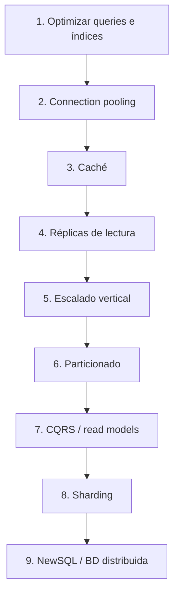

# Escalabilidad de bases de datos

Escalar es **aumentar la capacidad de atender carga manteniendo la latencia dentro del objetivo**. La pregunta de nivel senior no es "¿cómo shardeo?", sino **"¿cuál es el cuello de botella real y cuál es el paso más barato que lo resuelve?"**. Cada paso del camino agrega complejidad operativa y de consistencia; se avanza solo con evidencia.

## Vertical vs horizontal

| | Vertical (scale up) | Horizontal (scale out) |
|---|---|---|
| Qué es | Máquina más grande (CPU, RAM, IOPS) | Más máquinas |
| Complejidad | Ninguna en el código | Alta: routing, consistencia, operaciones |
| Límite | La instancia más grande disponible y su precio | Teóricamente alto; en la práctica, el diseño |
| Downtime | Normalmente un reinicio/failover breve | Depende de la estrategia |
| Consistencia | ACID intacto | Lag de réplicas, transacciones distribuidas |

- Escalar lecturas horizontalmente es relativamente fácil (réplicas, caché). **Escalar escrituras horizontalmente es difícil** (sharding o NewSQL).

## Métricas para decidir

Nunca escales "a ojo". Mide:

- **Latencia p95/p99** de las queries y de los endpoints (el promedio esconde los problemas).
- **Throughput**: TPS/QPS, separado en lecturas y escrituras.
- **CPU** de la BD: sostenido > 70-80% es señal de alerta.
- **Memoria y cache hit ratio**: en Postgres, hit ratio de `shared_buffers` < 99% en OLTP indica que el working set no cabe en RAM.
- **I/O**: IOPS, throughput de disco, latencia de lectura/escritura, créditos de burst (gp2/gp3).
- **Conexiones**: activas vs máximas, esperas en el pool.
- **Contención**: lock waits, deadlocks, `idle in transaction`.
- **Replication lag**, tamaño de la BD y ritmo de crecimiento.
- Top queries por tiempo total (`pg_stat_statements`), no por latencia individual.

```sql
-- Top 10 queries por tiempo total consumido
SELECT calls, round(total_exec_time) AS total_ms, round(mean_exec_time, 2) AS mean_ms,
       rows, left(query, 80) AS query
FROM pg_stat_statements
ORDER BY total_exec_time DESC
LIMIT 10;

-- Cache hit ratio
SELECT round(sum(blks_hit) * 100.0 / nullif(sum(blks_hit) + sum(blks_read), 0), 2) AS hit_pct
FROM pg_stat_database;
```

Ver [Observabilidad.md](./Observabilidad.md) y [Performance.md](./Performance.md).

## Little's Law

**L = λ × W**: concurrencia promedio = tasa de llegada × tiempo en el sistema.

- Con 2.000 queries/s y 5 ms por query: `L = 2000 × 0.005 = 10` conexiones ocupadas en promedio. No necesitas 500 conexiones; necesitas ~10-20 bien usadas.
- Si la latencia sube a 50 ms (por locks o disco), la misma carga necesita **100 conexiones concurrentes**: el pool se agota y las esperas se disparan. Por eso **una query lenta es un problema de capacidad**, no solo de experiencia.
- Consecuencia práctica: reducir `W` (optimizar queries) aumenta la capacidad sin hardware nuevo.
- Referencia de dimensionamiento de pool en Postgres: empezar en torno a `núcleos × 2` conexiones activas por instancia y ajustar midiendo. Ver [ConnectionPooling.md](./ConnectionPooling.md).

## El camino de escalado, en orden práctico



El orden no es dogma (el escalado vertical puede ir antes si es una emergencia), pero refleja **costo creciente de complejidad**.

### 1. Optimizar queries e índices

- Qué: `EXPLAIN (ANALYZE, BUFFERS)`, índices compuestos/parciales/covering, eliminar N+1, paginación keyset, evitar `SELECT *`.
- Por qué primero: suele dar mejoras de **10-1000x** a costo casi nulo. Ningún cluster compensa un seq scan en una tabla de 100M filas.
- Pasar al siguiente cuando: las top queries ya usan buenos planes y la carga sigue creciendo.
- Ver [Indices.md](./Indices.md), [PlanesDeEjecucion.md](./PlanesDeEjecucion.md), [SQLAvanzado.md](./SQLAvanzado.md), [ORMs.md](./ORMs.md).

### 2. Connection pooling

- Qué: pool en la app y/o PgBouncer/RDS Proxy en modo transaction.
- Por qué: cada conexión de Postgres es un proceso (~varios MB); miles de conexiones desde lambdas o pods degradan el motor aunque estén ociosas.
- Señal: `too many connections`, muchas conexiones `idle`, picos de latencia al escalar pods, serverless.
- Ver [ConnectionPooling.md](./ConnectionPooling.md).

### 3. Caché

- Qué: Redis/Memcached con cache-aside, caché HTTP/CDN, materialized views.
- Por qué: la query más rápida es la que no llega a la BD. Ideal para lecturas repetidas con tolerancia a datos algo viejos.
- Señal: alta proporción de lecturas repetidas (catálogo, configuración, perfiles), hot keys de lectura.
- Costo: invalidación, stampede, inconsistencia. Ver [Caching.md](./Caching.md).

### 4. Réplicas de lectura

- Qué: enviar lecturas tolerantes al lag a réplicas.
- Señal: CPU del primario dominada por lecturas que no se pueden cachear bien (búsquedas, listados filtrados, reportes).
- Costo: replication lag, read-your-writes, enrutamiento. **No ayuda con escrituras.**
- Ver [ReadReplicas.md](./ReadReplicas.md).

### 5. Escalado vertical

- Qué: instancia más grande, más RAM para que el working set quepa, discos con más IOPS (io2, NVMe local).
- Por qué aquí: cero cambios de código. Instancias con 100+ vCPU y TBs de RAM cubren la gran mayoría de negocios.
- Señal para dejar de subir: el costo crece más que lineal, estás cerca de la instancia más grande, o el cuello es de contención (locks), que más CPU no arregla.

### 6. Particionado

- Qué: `PARTITION BY RANGE/LIST/HASH` en tablas enormes, archivar datos fríos.
- Señal: tablas de cientos de GB/TB, índices que no caben en RAM, VACUUM eterno, retenciones con DELETE masivos.
- Beneficio: pruning, mantenimiento por partición, `DROP` de particiones viejas.
- Ver [Sharding.md](./Sharding.md).

### 7. CQRS y read models

- Qué: separar el modelo de escritura (normalizado, OLTP) de modelos de lectura desnormalizados, alimentados por eventos/CDC: Elasticsearch/OpenSearch para búsqueda, tablas agregadas, un warehouse para analítica.
- Señal: la misma BD sirve OLTP y consultas analíticas o de búsqueda full-text que compiten por recursos; lecturas con joins de 8 tablas en cada request.
- Costo: consistencia eventual entre modelos, infraestructura de eventos.
- Ver [OutboxCDC.md](./OutboxCDC.md), [OLTPvsOLAP.md](./OLTPvsOLAP.md), [Normalizacion.md](./Normalizacion.md).

### 8. Sharding

- Qué: repartir los datos entre varios clusters por una shard key.
- Señal: **las escrituras** o el tamaño del dataset superan lo que una instancia grande soporta, incluso tras todo lo anterior.
- Costo: joins y transacciones cross-shard, resharding, operaciones por N.
- Ver [Sharding.md](./Sharding.md) y [TransaccionesDistribuidas.md](./TransaccionesDistribuidas.md).

### 9. NewSQL / bases distribuidas

- Qué: CockroachDB, YugabyteDB, Google Spanner, TiDB, Aurora Limitless/DSQL. Sharding automático + transacciones ACID distribuidas con consenso (Raft/Paxos).
- Cuándo: necesitas escalar escrituras **y** mantener SQL y transacciones fuertes, o multi-región activo-activo.
- Costo: latencia por escritura mayor (consenso entre réplicas, a veces entre regiones), compatibilidad parcial con Postgres/MySQL, costo de licencia/servicio, modelado cuidadoso de las claves para evitar hotspots.
- Alternativa: NoSQL (DynamoDB, Cassandra) si el patrón de acceso es simple y conocido. Ver [SQLvsNoSQL.md](./SQLvsNoSQL.md) y [ModeladoNoSQL.md](./ModeladoNoSQL.md).

## Tabla resumen: síntoma → paso

| Síntoma | Paso probable |
|---|---|
| Pocas queries consumen la mayor parte del tiempo total | Optimizar queries/índices |
| `too many connections`, serverless, cientos de pods | Pooling |
| Las mismas lecturas se repiten miles de veces | Caché |
| CPU alta por lecturas variadas, escrituras bajas | Réplicas |
| Hit ratio bajo, working set > RAM | Vertical (más RAM) o archivar/particionar |
| Tablas gigantes, retención costosa | Particionado |
| Búsqueda/analítica compitiendo con OLTP | CQRS, read models, warehouse |
| Escrituras saturan la instancia más grande | Sharding o NewSQL |
| Lock contention en filas calientes | Rediseño del modelo (no más hardware) |

## Ejemplo: evolución de un e-commerce

**Etapa 1: MVP (1k usuarios/día).** Una instancia Postgres pequeña, monolito. Todo en una BD. No hay que hacer nada más.

**Etapa 2: tracción (50k usuarios/día).** El listado de productos tarda 2 s.
- `pg_stat_statements` muestra un filtro por categoría + orden por precio sin índice y un N+1 del ORM en las imágenes.
- Índice compuesto `(categoria_id, precio)` y eager loading → p95 de 2 s a 40 ms.

**Etapa 3: campañas (500k usuarios/día).** En Black Friday aparecen `too many connections` al autoescalar pods.
- PgBouncer en modo transaction; pool por pod reducido.
- Redis con cache-aside para ficha de producto y categorías (TTL corto + invalidación al editar).

**Etapa 4: crecimiento sostenido.** La CPU del primario llega a 75%, 85% lecturas.
- Dos réplicas para búsquedas y listados; carrito, checkout y "mis pedidos" recién creados leen del primario (read-your-writes).
- Se sube la instancia primaria para que el working set quepa en RAM.

**Etapa 5: datos grandes.** `pedidos` y `eventos_tracking` superan 2 TB; el DELETE nocturno de eventos viejos genera bloat.
- `eventos_tracking` particionada por mes con pg_partman; se hace `DROP` de particiones de más de 13 meses.
- La búsqueda de productos pasa a OpenSearch alimentado por CDC (Debezium). Los reportes a un warehouse (BigQuery/Redshift/ClickHouse).

**Etapa 6: escala internacional.** Marketplace con miles de vendedores; las escrituras (pedidos, stock, pagos) saturan la instancia más grande razonable.
- Se separan dominios: catálogo, pedidos, pagos, cada uno con su BD (el checkout pasa a ser una saga; ver [TransaccionesDistribuidas.md](./TransaccionesDistribuidas.md)).
- La BD de pedidos se shardea por `vendedor_id` con Citus (co-location de `pedidos` e `items`), con los vendedores gigantes en shards dedicados.
- Alternativa evaluada: CockroachDB/Aurora DSQL si se requiere multi-región activo-activo.

Lo importante: cada etapa se justificó con una métrica y se eligió el paso más barato disponible.

## Preguntas de entrevista

1. **La BD está al 90% de CPU. ¿Qué haces primero?**
   Mirar `pg_stat_statements` por tiempo total y los planes de las top queries. Casi siempre hay un índice faltante o un N+1 antes que un problema de hardware.
2. **¿Por qué agregar réplicas no arregla un problema de escrituras?**
   Cada réplica aplica todas las escrituras del primario; el primario sigue siendo el único que las acepta.
3. **Explica Little's Law aplicada a un pool de conexiones.**
   Conexiones necesarias = QPS × latencia. Si la latencia se multiplica por 10 por contención, el pool necesario también, y se agota: la latencia es capacidad.
4. **¿Cuándo prefieres escalar verticalmente en vez de shardear?**
   Casi siempre que la instancia más grande razonable aún alcanza: cero cambios de código, ACID intacto. El sharding se justifica cuando las escrituras o el dataset ya no caben.
5. **¿Qué es CQRS y qué costo tiene?**
   Separar el modelo de escritura de modelos de lectura optimizados, sincronizados por eventos. El costo es consistencia eventual y más infraestructura.
6. **¿Qué señales indican que el working set no cabe en memoria?**
   Cache hit ratio en caída, aumento de lecturas físicas, latencia de I/O alta y queries que antes eran rápidas degradándose con el crecimiento de datos.
7. **¿Cuándo considerarías NewSQL?**
   Escrituras que superan un nodo con necesidad de transacciones ACID entre entidades, o multi-región con escritura local. Aceptando mayor latencia por commit y compatibilidad parcial.

## Errores comunes

- Saltar a microservicios, sharding o NoSQL sin haber optimizado queries.
- Mirar el promedio de latencia en lugar de p95/p99.
- Subir `max_connections` a miles en vez de poner un pooler.
- Cachear sin estrategia de invalidación y crear bugs de consistencia.
- Enviar a réplicas lecturas que necesitan read-your-writes.
- Tratar un problema de contención de locks (filas calientes) con más hardware.
- No planificar el crecimiento: descubrir el límite en Black Friday en vez de con pruebas de carga.
