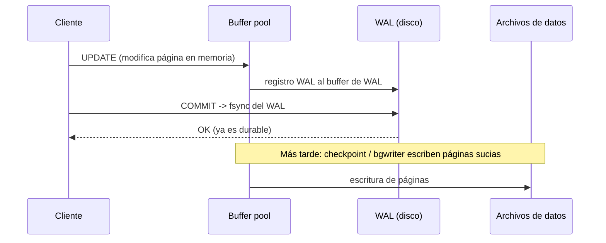
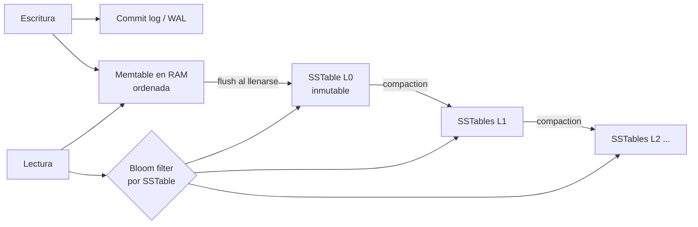

# Internos del motor de base de datos

Entender cómo un motor guarda y lee datos explica casi todo lo "raro" que ves en producción: bloat, VACUUM, por qué un UUID aleatorio como PK duele en MySQL, por qué el commit cuesta un `fsync`, o por qué el optimizador eligió un seq scan. Enfoque en **PostgreSQL** y **MySQL InnoDB**, con notas de SQL Server y motores LSM.

## Páginas (bloques)
- La unidad de I/O no es la fila, es la **página**: **8 KB** en Postgres y SQL Server, **16 KB** en InnoDB.
- Leer una fila implica traer su página completa a memoria. Por eso importan la **localidad** y el tamaño de las filas: filas más chicas = más filas por página = menos I/O.
- Estructura de una página en Postgres (heap):
```
+-----------------------------------------------------+
| Header (LSN, checksums, punteros libre)             |
| Line pointers: [1][2][3][4] ->                      |
|                                                     |
|              espacio libre                          |
|                                                     |
|                    <- Tupla 4 | Tupla 3 | Tupla 2 | Tupla 1 |
+-----------------------------------------------------+
```
- Cada fila se identifica por su **ctid** = (número de página, posición del line pointer). Los índices de Postgres apuntan a ctids.

## Heap vs índice clustered

| | Postgres (heap) | InnoDB (clustered) | SQL Server |
|---|---|---|---|
| Dónde vive la fila | Heap sin orden; los índices apuntan al ctid | Dentro de las hojas del B-tree de la **PK** | Clustered index opcional; si no hay, heap |
| Índice secundario guarda | ctid | **Valor de la PK** | Clave clustered (o RID si heap) |
| Lookup por secundario | índice → heap | índice secundario → índice PK (doble búsqueda) | similar a InnoDB |
| Range scan por PK | Puede ser aleatorio en heap | Secuencial, muy eficiente | Secuencial |
| `CLUSTER` | Reordena una vez; no se mantiene | Siempre ordenado | Siempre ordenado |

- Implicancias en InnoDB:
  - **PK aleatoria (UUIDv4)** → inserciones en páginas al azar, *page splits*, fragmentación y buffer pool ineficiente. Prefiere `BIGINT AUTO_INCREMENT` o IDs ordenables por tiempo (UUIDv7, ULID).
  - **PK ancha** encarece todos los índices secundarios (cada entrada la incluye).
  - Un índice secundario "cubre" automáticamente las columnas de la PK.
- En Postgres un UUIDv4 también degrada el **índice** de la PK (inserts aleatorios en el B-tree), pero no el heap. Ver [Indices.md](Indices.md).

## Buffer pool / shared_buffers
- Caché de páginas en memoria. Toda lectura y escritura pasa por aquí; las páginas modificadas quedan **sucias** (dirty) y se escriben a disco después.

| | Postgres `shared_buffers` | InnoDB `innodb_buffer_pool_size` |
|---|---|---|
| Tamaño típico | ~25% de la RAM | 50–75% de la RAM |
| Relación con el SO | Usa además el **page cache del SO** (doble buffering) | Normalmente `O_DIRECT`, evita el page cache |
| Reemplazo | Clock sweep | LRU con zona "old/young" (resiste scans) |

- **Hit ratio** alto (>99% en OLTP) indica que el working set cabe en memoria. Cuando no cabe, la latencia salta de µs a ms. Ver [Performance.md](Performance.md).
```sql
SELECT sum(blks_hit)::float / nullif(sum(blks_hit + blks_read), 0) AS hit_ratio
FROM pg_stat_database;
-- blks_read puede venir del page cache del SO, no necesariamente del disco
```

## WAL / redo log: cómo se logra la durabilidad
**Write-Ahead Logging**: antes de que una página modificada llegue a disco, el **registro del cambio** debe estar persistido en el log.



- **Por qué funciona**: el commit solo necesita un `fsync` de escritura **secuencial** en el log (barato), no escribir páginas aleatorias por todo el disco. Tras un crash, el motor **reproduce** (redo) el WAL desde el último checkpoint.
- **fsync**: sin él, el SO puede tener los datos en su caché y perderlos al cortarse la luz. Discos/controladoras que "mienten" sobre el flush rompen la durabilidad.
- **Group commit**: varias transacciones que confirman casi a la vez comparten un solo `fsync` → más throughput bajo concurrencia.
- **Checkpoints**: escriben todas las páginas sucias y marcan un punto desde el cual empezar la recuperación.
  - Checkpoints frecuentes = recuperación rápida pero más I/O. Postgres: `checkpoint_timeout`, `max_wal_size`.
  - **Torn pages**: una página de 8 KB puede quedar escrita a medias. Postgres escribe la página completa en el WAL la primera vez que se modifica tras un checkpoint (`full_page_writes`); InnoDB usa el **doublewrite buffer**.
- **Perillas de durabilidad** (trade-off latencia vs pérdida):

| Motor | Configuración | Riesgo |
|---|---|---|
| Postgres | `synchronous_commit = off` | Puedes perder las últimas ~centenas de ms de commits; **no** corrompe |
| InnoDB | `innodb_flush_log_at_trx_commit = 1` (default) | Durable |
| InnoDB | `= 2` (escribe al SO, fsync cada ~1s) | Pierdes ~1s si cae el SO/máquina |
| InnoDB | `= 0` | Pierdes ~1s incluso si solo cae mysqld |

- El WAL también alimenta **replicación física** ([ReadReplicas.md](ReadReplicas.md)), **PITR** ([Backups.md](Backups.md)) y **logical decoding / CDC** ([OutboxCDC.md](OutboxCDC.md)). MySQL usa además un **binlog** separado para replicación (y un two-phase commit interno entre redo log y binlog).

## MVCC: undo log (InnoDB) vs versiones en el heap (Postgres)
Ambos implementan MVCC, pero guardan las versiones viejas en lugares opuestos.

```
Postgres: versiones en el heap          InnoDB: update in-place + undo
+-------------------------------+       +--------------------+
| v1  xmin=100 xmax=205  muerta |       | fila actual (v3)   |---+ roll pointer
| v2  xmin=205 xmax=310  muerta |       +--------------------+   |
| v3  xmin=310 xmax=0    viva   |       undo log:  v2 -> v1  <---+
+-------------------------------+       (versiones viejas se reconstruyen)
```

| | Postgres | InnoDB |
|---|---|---|
| UPDATE | Escribe una **tupla nueva**; la vieja queda marcada | Modifica **en el lugar**; la versión previa va al undo log |
| Lectores de versiones viejas | Leen la tupla vieja del heap | Reconstruyen desde el undo (más caro si la cadena es larga) |
| Limpieza | **VACUUM** | **Purge thread** |
| Síntoma con tx largas | Bloat de tablas e índices | *History list length* alto, undo enorme |
| ROLLBACK | Barato (la tupla nueva queda muerta) | Caro (aplica el undo) |
| Índices en UPDATE | Nueva entrada en **todos** los índices (salvo HOT) | Solo los índices cuyas columnas cambian |

## MVCC en Postgres en detalle
- Cada tupla tiene columnas ocultas: **xmin** (XID que la creó) y **xmax** (XID que la borró/actualizó o bloqueó; 0 si viva).
```sql
SELECT xmin, xmax, ctid, * FROM productos WHERE id = 7;
```
- Un **snapshot** es: `xmin` (todo XID menor ya terminó), `xmax` (todo XID ≥ aún no empezó) y la lista de XIDs **en curso**.
- Regla de visibilidad simplificada: una tupla es visible si su `xmin` confirmó y es visible en mi snapshot, y su `xmax` es 0, abortó o no es visible para mí.
- El estado de commit de cada XID vive en `pg_xact` (commit log); los **hint bits** en la tupla cachean ese resultado (por eso un `SELECT` puede generar escrituras la primera vez).
- `DELETE` solo pone `xmax`. `UPDATE` = `DELETE` + `INSERT`. La tupla vieja queda **muerta** cuando ningún snapshot activo puede verla.

## VACUUM y autovacuum
- **VACUUM** (normal, no bloquea lecturas ni escrituras):
  - Marca el espacio de tuplas muertas como reutilizable (Free Space Map) y limpia las entradas de índice que las apuntan.
  - Actualiza el **visibility map** → habilita **index-only scans** (ver [PlanesDeEjecucion.md](PlanesDeEjecucion.md)).
  - **Congela** tuplas viejas (anti-wraparound).
  - No devuelve espacio al SO (salvo páginas vacías al final del archivo).
- **VACUUM FULL**: reescribe la tabla compacta pero toma `ACCESS EXCLUSIVE` (tabla inaccesible). En producción usa **pg_repack** o `pg_squeeze`.
- **Autovacuum** se dispara cuando `tuplas_muertas > autovacuum_vacuum_threshold (50) + autovacuum_vacuum_scale_factor (0.2) × filas`. En una tabla de 500M filas eso es 100M tuplas muertas: demasiado tarde. Ajusta por tabla:
```sql
ALTER TABLE eventos SET (autovacuum_vacuum_scale_factor = 0.01,
                         autovacuum_vacuum_cost_limit = 2000);

SELECT relname, n_live_tup, n_dead_tup, last_autovacuum
FROM pg_stat_user_tables ORDER BY n_dead_tup DESC LIMIT 10;
```
- Lo que **impide** que VACUUM limpie: transacciones largas o *idle in transaction*, replication slots abandonados, `hot_standby_feedback` con queries largas en réplicas, transacciones preparadas (2PC) olvidadas. Ver [Transacciones.md](Transacciones.md).

## Bloat
- Espacio ocupado por tuplas muertas o huecos no reutilizados en tablas e **índices**.
- Consecuencias: más páginas que leer (scans más lentos), peor hit ratio, backups más grandes.
- Causas típicas: patrones de update/delete masivos (colas, tablas de sesiones), autovacuum que no alcanza, transacciones largas.
- Remedios: tunear autovacuum, `REINDEX CONCURRENTLY` para índices, pg_repack para tablas, **particionar** y hacer `DROP` de particiones viejas en vez de `DELETE` masivo.

## Transaction ID wraparound
- Los XIDs son de **32 bits**. La comparación es circular: para cada XID hay ~2.100 millones "en el pasado" y ~2.100 millones "en el futuro".
- Si una tupla vieja no se congela, al dar la vuelta su `xmin` pasaría a parecer "futuro" → **los datos desaparecerían**.
- **Freezing**: VACUUM marca tuplas suficientemente viejas como congeladas (visibles para todos siempre).
- Protecciones: al superar `autovacuum_freeze_max_age` (200M por defecto) se lanza un autovacuum **anti-wraparound** que no se puede cancelar; si la edad se acerca al límite, Postgres **deja de aceptar escrituras** hasta que corras VACUUM. Es una caída total.
```sql
SELECT datname, age(datfrozenxid) FROM pg_database ORDER BY 2 DESC;
-- Alerta si se acerca a 1.000M; emergencia cerca de 2.000M
```
- Tablas con muchísimas escrituras (miles de millones de XIDs) necesitan vigilancia explícita. Ver [Observabilidad.md](Observabilidad.md).

## HOT updates (Heap-Only Tuples)
- Si un `UPDATE` **no modifica ninguna columna indexada** y hay espacio en la **misma página**, Postgres crea la nueva versión ahí y la encadena desde la vieja, **sin tocar ningún índice**.
- Ahorra escrituras en índices, WAL y bloat de índices; la cadena se poda en lecturas posteriores (pruning) sin esperar a VACUUM.
- Para favorecerlos:
  - Deja espacio libre en páginas: `ALTER TABLE sesiones SET (fillfactor = 80);`
  - No indexes columnas que cambian constantemente (p. ej. `updated_at`, `last_seen`) si no lo necesitas: un índice sobre ellas mata los HOT.
```sql
SELECT relname, n_tup_upd, n_tup_hot_upd,
       round(100.0 * n_tup_hot_upd / nullif(n_tup_upd, 0), 1) AS pct_hot
FROM pg_stat_user_tables ORDER BY n_tup_upd DESC LIMIT 10;
```

## TOAST
- Una tupla debe caber en una página de 8 KB. Valores grandes (`text`, `jsonb`, `bytea`) se procesan cuando la fila supera ~**2 KB** (`TOAST_TUPLE_THRESHOLD`):
  1. Se intenta **comprimir** (pglz, o `lz4` desde PG 14 con `default_toast_compression`).
  2. Si aún no cabe, se mueven **fuera de línea** a una tabla TOAST asociada, partidos en chunks; en la fila queda un puntero.
- Estrategias por columna: `PLAIN`, `EXTENDED` (default: comprime y saca), `EXTERNAL` (saca sin comprimir, útil para substrings rápidos), `MAIN`.
- Implicancias senior:
  - `SELECT *` sobre filas con JSON grande paga el **detoast** aunque no uses la columna: selecciona solo lo necesario.
  - Modificar una clave dentro de un `jsonb` grande reescribe **el valor completo** (y genera WAL proporcional). Documentos enormes muy mutables son mala idea.
  - Un `UPDATE` que no toca la columna TOAST no la copia (el puntero se reutiliza).
- InnoDB tiene algo equivalente: overflow pages para `BLOB/TEXT` largos según el row format (`DYNAMIC`).

## B-tree vs LSM tree
Dos filosofías de almacenamiento.

- **B-tree** (Postgres, InnoDB, SQL Server, Oracle): estructura balanceada de páginas, actualiza **en el lugar**. Lecturas predecibles (O(log n), 3–4 niveles para miles de millones de filas); escrituras aleatorias.
- **LSM tree** (RocksDB, Cassandra, ScyllaDB, LevelDB, HBase; MyRocks en MySQL): convierte escrituras aleatorias en **secuenciales**.



- **Escritura**: append al commit log + insertar en la **memtable** (árbol ordenado en memoria). Al llenarse, se vuelca como **SSTable** (archivo ordenado e inmutable).
- **Lectura**: memtable → SSTables de la más nueva a la más vieja. **Bloom filters** evitan leer SSTables que seguro no tienen la clave.
- **Borrado**: se escribe un **tombstone**; el dato se elimina recién en la compaction. En Cassandra, muchos tombstones destruyen la latencia de lectura (y colas sobre Cassandra son un antipatrón).
- **Compaction**: fusiona SSTables, descarta versiones viejas y tombstones.
  - **Size-tiered**: junta archivos de tamaño similar. Menos escritura, más espacio y lecturas peores.
  - **Leveled**: niveles con rangos no solapados. Lecturas y espacio mejores, más escritura.

### Amplificaciones

| | B-tree | LSM (size-tiered) | LSM (leveled) |
|---|---|---|---|
| **Escritura** (bytes escritos / bytes lógicos) | Media-alta (página completa + WAL por cambio pequeño) | Baja | Media-alta |
| **Lectura** (I/O por consulta) | Baja y predecible | Alta (muchas SSTables) | Media |
| **Espacio** | Media (fragmentación, fillfactor) | Alta (duplicados hasta compactar) | Baja |
| Ideal para | OLTP mixto, lecturas por rango, transacciones | Ingesta masiva, series temporales, logs | Balance con muchas escrituras |

- No existe estructura que minimice las tres a la vez (conjetura RUM: Read, Update, Memory).
- Cuándo **no** LSM: cargas con muchas lecturas aleatorias puntuales de claves inexistentes sin buenos bloom filters, o cuando necesitas latencia de lectura muy estable (la compaction genera picos). Ver [ModeladoNoSQL.md](ModeladoNoSQL.md) y [SQLvsNoSQL.md](SQLvsNoSQL.md).

## El optimizador basado en costos
- El planner genera planes alternativos (orden de joins, algoritmo de join, uso de índices) y elige el de **menor costo estimado**. El costo es una unidad abstracta basada en I/O y CPU.
- Parámetros de costo en Postgres: `seq_page_cost = 1`, `random_page_cost = 4` (baja a ~1.1 en SSD), `cpu_tuple_cost`, `effective_cache_size` (cuánto caché cree que hay).
- La pieza crítica son las **estadísticas**: si la estimación de filas es mala, el plan es malo.
```sql
SELECT attname, null_frac, n_distinct, most_common_vals, histogram_bounds, correlation
FROM pg_stats WHERE tablename = 'pedidos' AND attname = 'estado';
```
  - `most_common_vals`/`freqs`: valores frecuentes y su proporción.
  - `histogram_bounds`: distribución del resto.
  - `correlation`: cuánto coincide el orden físico con el lógico (afecta el costo de index scan).
- Se recolectan con `ANALYZE` (autovacuum también lo hace). Tras cargas masivas, corre `ANALYZE` manual.
- Limitación clásica: asume **independencia entre columnas**. `WHERE ciudad='Santiago' AND pais='Chile'` se subestima. Solución: estadísticas extendidas.
```sql
CREATE STATISTICS st_ciudad_pais (dependencies, ndistinct) ON ciudad, pais FROM clientes;
ANALYZE clientes;
```
- Sube `default_statistics_target` (100) por columna en distribuciones sesgadas: `ALTER TABLE pedidos ALTER COLUMN cliente_id SET STATISTICS 1000;`
- Diferencias: SQL Server y Oracle cachean planes y sufren **parameter sniffing**; Postgres re-planifica prepared statements hasta 5 ejecuciones y luego puede pasar a plan genérico (`plan_cache_mode`). Ver [PlanesDeEjecucion.md](PlanesDeEjecucion.md).

## Preguntas de entrevista
1. **¿Cómo garantiza durabilidad un commit sin escribir las páginas de datos?** Write-ahead logging: el cambio se registra en el WAL y se hace `fsync` antes de confirmar; las páginas se escriben después y, tras un crash, se reproduce el WAL desde el último checkpoint.
2. **¿Por qué un UUIDv4 como PK es peor en InnoDB que en Postgres?** InnoDB guarda la fila en el B-tree de la PK: claves aleatorias provocan page splits y fragmentación de la tabla entera, y la PK se replica en cada índice secundario. En Postgres solo sufre el índice.
3. **¿Qué es el bloat y qué lo causa?** Espacio de tuplas muertas no reutilizado; lo causan updates/deletes masivos con autovacuum insuficiente o transacciones largas que impiden limpiar.
4. **¿Qué es transaction ID wraparound?** XIDs de 32 bits circulares; si no se congelan tuplas viejas, parecerían futuras. Postgres fuerza VACUUM anti-wraparound y, al límite, deja de aceptar escrituras.
5. **¿Qué es un HOT update y cómo lo favoreces?** Update que no toca columnas indexadas y cabe en la misma página: no actualiza índices. Se favorece con `fillfactor` < 100 y evitando indexar columnas volátiles.
6. **B-tree vs LSM: ¿cuándo cada uno?** B-tree para OLTP con lecturas predecibles y rangos; LSM para ingesta masiva de escrituras, aceptando amplificación de lectura y picos por compaction.
7. **¿Por qué el optimizador elige un mal plan?** Estimaciones de cardinalidad erróneas: estadísticas desactualizadas, columnas correlacionadas, distribuciones sesgadas o parámetros de costo que no reflejan el hardware.
8. **Undo log vs versiones en heap: trade-offs.** InnoDB: updates in-place, índices menos afectados, rollback caro y lectores viejos reconstruyen desde undo. Postgres: rollback barato, pero cada update crea tupla nueva (bloat, entradas de índice) y requiere VACUUM.

## Errores comunes
- Desactivar autovacuum "porque consume recursos".
- Usar `VACUUM FULL` en producción en horario hábil.
- `synchronous_commit = off` o `innodb_flush_log_at_trx_commit = 2` sin saber que se pueden perder commits confirmados.
- Indexar `updated_at` en tablas de alto update sin necesidad (mata HOT).
- No monitorear `age(datfrozenxid)` ni replication slots inactivos.
- Guardar documentos JSON enormes que se modifican parcialmente con frecuencia.
- Dejar `random_page_cost = 4` en SSD/NVMe.
