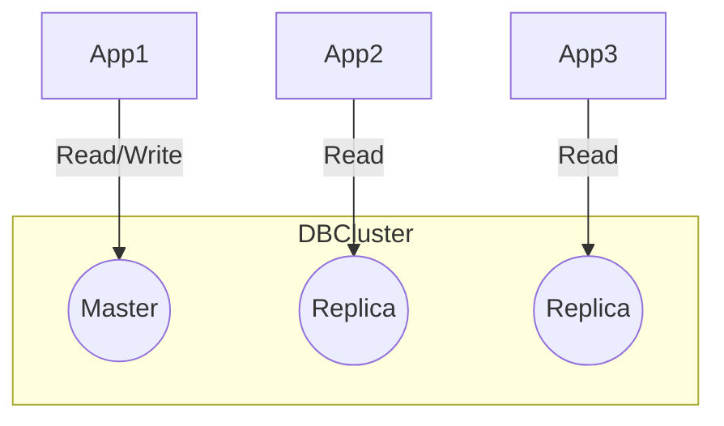

---

## Ejemplo visual de arquitectura de datos

**Explicación:**
Este diagrama muestra una arquitectura típica con una base de datos principal y réplicas de solo lectura para escalar consultas y mejorar disponibilidad.
