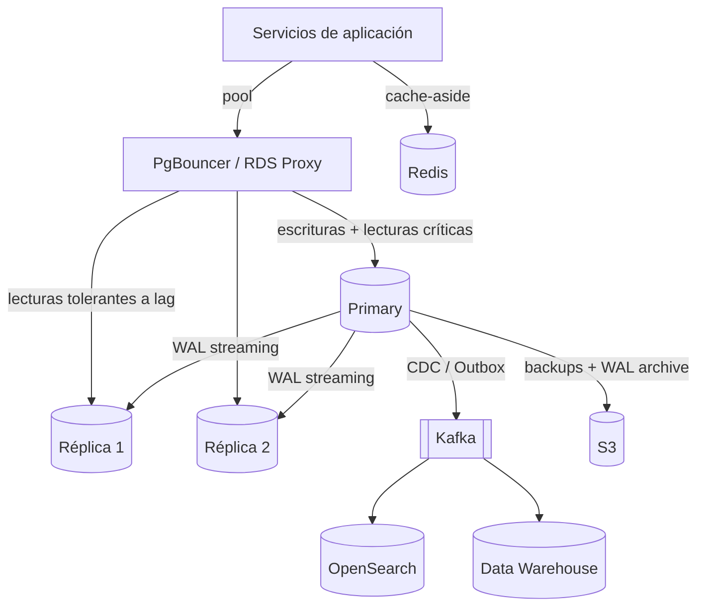

# Bases de Datos y Consistencia — Ruta a nivel Senior

Esta carpeta cubre lo que se espera que un **backend senior** domine sobre bases de datos: no solo "usar SQL", sino entender **cómo funciona el motor por dentro**, **diagnosticar** problemas en producción, **diseñar** esquemas que escalen y **razonar sobre consistencia** en sistemas distribuidos.

> Qué diferencia a un senior: sabe **por qué** una query es lenta (y lo demuestra con `EXPLAIN ANALYZE`), sabe **qué anomalía** de concurrencia puede ocurrir en su código, sabe cambiar un esquema **sin downtime**, y sabe **cuándo no** introducir sharding, NoSQL o caché.

---

## Índice por niveles

### 1. Fundamentos de modelado y SQL
| Archivo | Qué aprendes |
|---|---|
| [Normalizacion.md](Normalizacion.md) | Formas normales, desnormalización deliberada, claves, constraints |
| [SQLAvanzado.md](SQLAvanzado.md) | JOINs, window functions, CTEs, UPSERT, ejercicios típicos de entrevista |
| [SQLvsNoSQL.md](SQLvsNoSQL.md) | Criterios de decisión, NewSQL, persistencia políglota |

### 2. Rendimiento
| Archivo | Qué aprendes |
|---|---|
| [Indices.md](Indices.md) | B-tree, índices compuestos, covering, parciales, cuándo no se usan |
| [PlanesDeEjecucion.md](PlanesDeEjecucion.md) | Leer `EXPLAIN ANALYZE`, tipos de scan y join, señales de alerta |
| [Performance.md](Performance.md) | Metodología de optimización, paginación keyset, batch, timeouts |
| [ConnectionPooling.md](ConnectionPooling.md) | Tamaño de pool, PgBouncer, serverless |
| [ORMs.md](ORMs.md) | N+1, lazy vs eager, cuándo bajar a SQL crudo |
| [Caching.md](Caching.md) | Cache-aside, invalidación, stampede, consistencia caché-BD |

### 3. Concurrencia e internos
| Archivo | Qué aprendes |
|---|---|
| [Transacciones.md](Transacciones.md) | ACID, niveles de aislamiento, anomalías, locking optimista/pesimista |
| [InternosMotor.md](InternosMotor.md) | Páginas, WAL, MVCC, VACUUM, B-tree vs LSM, optimizador |

### 4. Sistemas distribuidos y escala
| Archivo | Qué aprendes |
|---|---|
| [CAP.md](CAP.md) | CAP, PACELC, modelos de consistencia, quórums |
| [ReadReplicas.md](ReadReplicas.md) | Replicación, lag, failover, split brain |
| [Sharding.md](Sharding.md) | Particionamiento, shard key, consistent hashing, resharding |
| [Escalabilidad.md](Escalabilidad.md) | Camino de escalado paso a paso y cuándo dar cada paso |
| [TransaccionesDistribuidas.md](TransaccionesDistribuidas.md) | 2PC, Sagas, idempotencia |
| [OutboxCDC.md](OutboxCDC.md) | Dual-write, Transactional Outbox, CDC, event sourcing |
| [ModeladoNoSQL.md](ModeladoNoSQL.md) | MongoDB, DynamoDB single-table, Cassandra, Redis |
| [OLTPvsOLAP.md](OLTPvsOLAP.md) | Columnar, data warehouse, star schema, ETL/ELT |

### 5. Operación en producción
| Archivo | Qué aprendes |
|---|---|
| [Migraciones.md](Migraciones.md) | Cambios de esquema sin downtime (expand/contract), locks de DDL |
| [Seguridad.md](Seguridad.md) | SQL injection, mínimo privilegio, RLS, cifrado, secretos |
| [Backups.md](Backups.md) | RPO/RTO, PITR, pruebas de restauración |
| [Observabilidad.md](Observabilidad.md) | Métricas clave, queries de diagnóstico, runbook "la BD está lenta" |

### 6. Entrevista
| Archivo | Qué aprendes |
|---|---|
| [PreguntasEntrevista.md](PreguntasEntrevista.md) | Banco de preguntas senior + ejercicios de diseño |

---

## Orden de estudio recomendado

1. **Semana 1 — Fundamentos:** Normalizacion → SQLAvanzado → Indices → PlanesDeEjecucion.
2. **Semana 2 — Concurrencia:** Transacciones → InternosMotor.
3. **Semana 3 — Aplicación real:** Performance → ORMs → ConnectionPooling → Caching → Migraciones.
4. **Semana 4 — Distribuido:** CAP → ReadReplicas → Sharding → Escalabilidad → TransaccionesDistribuidas → OutboxCDC.
5. **Semana 5 — Ecosistema y operación:** SQLvsNoSQL → ModeladoNoSQL → OLTPvsOLAP → Seguridad → Backups → Observabilidad.
6. **Repaso:** PreguntasEntrevista (responde en voz alta sin mirar).

> Consejo: instala PostgreSQL localmente (`docker run -e POSTGRES_PASSWORD=pg -p 5432:5432 postgres`) y **ejecuta** los ejemplos. Ver un `Seq Scan` convertirse en `Index Only Scan`, o provocar un deadlock con dos terminales, enseña más que leer.

---

## Checklist de autoevaluación senior

Si puedes explicar todo esto sin mirar, estás en nivel senior:

- [ ] Por qué el orden de columnas en un índice compuesto importa y cuándo un índice **no** se usa.
- [ ] Leer un `EXPLAIN ANALYZE` e identificar el nodo caro y la causa (estadísticas, índice faltante, spill a disco).
- [ ] Diferencia entre Read Committed, Repeatable Read (snapshot) y Serializable, y qué es **write skew**.
- [ ] Cuándo usar locking optimista vs `SELECT ... FOR UPDATE`, y cómo hacer una cola con `SKIP LOCKED`.
- [ ] Qué es MVCC, por qué existe VACUUM y qué es el bloat.
- [ ] Qué hace el WAL y cómo garantiza durabilidad y replicación.
- [ ] Paginación keyset vs OFFSET.
- [ ] Detectar y corregir un N+1.
- [ ] Dimensionar un pool de conexiones y explicar por qué más conexiones no es más rápido.
- [ ] Renombrar una columna en una tabla de 500M filas **sin downtime**.
- [ ] Problemas del replication lag (read-your-writes) y cómo mitigarlos.
- [ ] CAP bien explicado (y por qué "CA" no existe en distribuido) + PACELC.
- [ ] Elegir una shard key y explicar hot partitions.
- [ ] Dual-write problem y Transactional Outbox.
- [ ] Saga con compensaciones + consumidores idempotentes.
- [ ] Cache-aside, invalidación y cache stampede.
- [ ] Diseñar una tabla DynamoDB a partir de patrones de acceso.
- [ ] RPO/RTO y PITR; por qué una réplica no es un backup.
- [ ] Runbook de "la base de datos está lenta" paso a paso.

---

## Arquitectura típica de datos

```mermaid
graph TD;
  App[Servicios de aplicación] -->|pool| PGB[PgBouncer / RDS Proxy]
  App -->|cache-aside| Redis[(Redis)]
  PGB -->|escrituras + lecturas críticas| Primary[(Primary)]
  PGB -->|lecturas tolerantes a lag| R1[(Réplica 1)]
  PGB --> R2[(Réplica 2)]
  Primary -->|WAL streaming| R1
  Primary -->|WAL streaming| R2
  Primary -->|CDC / Outbox| Kafka[[Kafka]]
  Kafka --> Search[(OpenSearch)]
  Kafka --> DW[(Data Warehouse)]
  Primary -->|backups + WAL archive| S3[(S3)]
```

**Explicación:** el primario recibe escrituras; las réplicas escalan lecturas; el pooler protege al motor de demasiadas conexiones; Redis absorbe lecturas calientes; los cambios salen por CDC/Outbox hacia búsqueda y analítica sin cargar la BD transaccional; los backups y el archivo de WAL permiten PITR.
