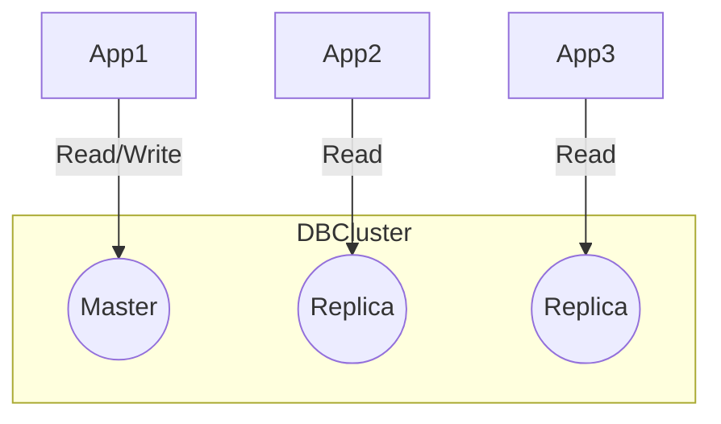

---

## ¿Cuándo usar relacional (SQL) vs. no relacional (NoSQL)?

### Usa base de datos **relacional (SQL)** cuando:
- Los datos tienen una **estructura clara y estable** (tablas, columnas bien definidas).
- Necesitas **relaciones complejas** entre entidades (joins) y garantizar **integridad referencial**.
- Requieres **transacciones ACID** fuertes (ej: banca, facturación, inventario, e-commerce).
- La **consistencia** es más importante que la velocidad de escritura masiva.
- Ejemplos: PostgreSQL, MySQL, SQL Server, Oracle.

### Usa base de datos **no relacional (NoSQL)** cuando:
- Los datos son **flexibles o cambiantes** (esquema variable, cada registro puede diferir).
- Necesitas **escalar horizontalmente** a gran volumen y alta velocidad de escritura.
- Priorizas **disponibilidad y rendimiento** sobre consistencia inmediata (eventual consistency).
- El acceso es por **clave** o por documentos completos, sin muchos joins.
- Ejemplos por tipo:
  - **Documental** (MongoDB): catálogos, perfiles, contenido con estructura variable.
  - **Clave-valor** (Redis, DynamoDB): caché, sesiones, contadores.
  - **Columnar** (Cassandra): grandes volúmenes de escritura, series temporales.
  - **Grafos** (Neo4j): redes sociales, recomendaciones, relaciones muy conectadas.

### Comparación rápida

| Criterio | Relacional (SQL) | No relacional (NoSQL) |
|---|---|---|
| Esquema | Fijo y estructurado | Flexible / sin esquema |
| Relaciones (joins) | Fuerte | Limitado o inexistente |
| Transacciones ACID | Sí, nativas | Parcial o eventual |
| Escalado | Vertical (principalmente) | Horizontal (nativo) |
| Consistencia | Fuerte | Eventual (normalmente) |
| Caso típico | Banca, ERP, facturación | Big data, tiempo real, caché |

> **Regla práctica:** empieza con SQL salvo que tengas una razón clara para NoSQL (escala masiva, esquema muy variable o necesidad extrema de rendimiento). Muchos sistemas reales usan **ambas** (persistencia políglota): SQL para lo transaccional y NoSQL para caché o datos flexibles.

Para más detalle, revisa [SQLvsNoSQL.md](SQLvsNoSQL.md).

---

## Ejemplo visual de arquitectura de datos

```mermaid
graph TD;
  subgraph DBCluster
    Master((Master))
    Replica1((Replica))
    Replica2((Replica))
  end
  App1-->|Read/Write|Master
  App2-->|Read|Replica1
  App3-->|Read|Replica2
```

**Explicación:**
Este diagrama muestra una arquitectura típica con una base de datos principal y réplicas de solo lectura para escalar consultas y mejorar disponibilidad.
