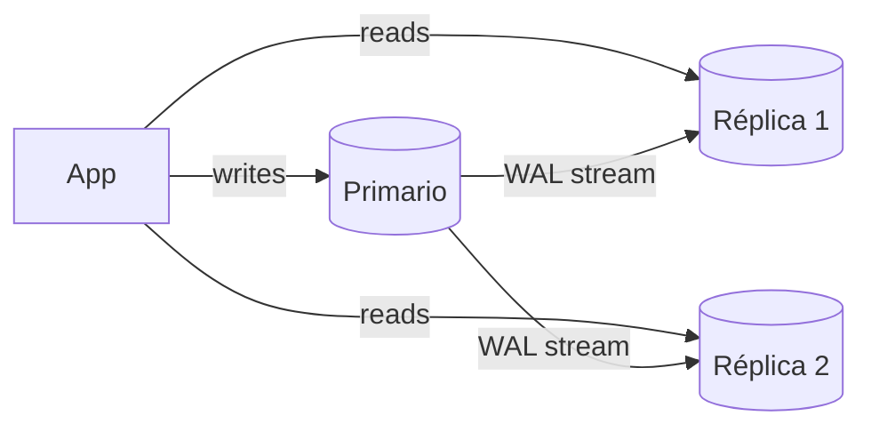
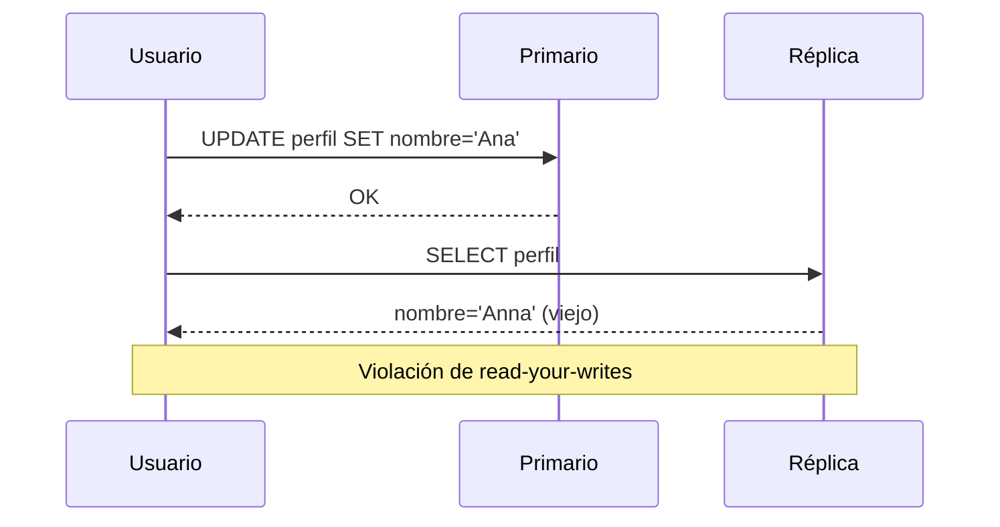

# Replicación y Read Replicas

La replicación mantiene **copias de los mismos datos en varios nodos**. Sirve para tres cosas distintas que conviene no mezclar:

- **Escalar lecturas**: repartir SELECTs entre réplicas.
- **Alta disponibilidad (HA)**: si cae el primario, promover una réplica.
- **Localidad**: tener datos cerca de usuarios en otra región.

Lo que **no** resuelve: escalar escrituras (todas pasan por el líder en el modelo clásico) ni proteger contra errores lógicos (un `DELETE` sin `WHERE` se replica en milisegundos). Ver [Backups.md](./Backups.md).

## Topologías

### Leader-follower (primario-réplica)



- Un único nodo acepta escrituras; los followers aplican el log del líder en el mismo orden.
- **Sin conflictos de escritura** por diseño: es el modelo por defecto de PostgreSQL, MySQL, RDS, Aurora, MongoDB replica sets.
- Límite: el throughput de escritura es el de una sola máquina.

### Multi-leader (multi-primario)

- Varios nodos aceptan escrituras y se replican entre sí (típico: un líder por región).
- Ventaja: escrituras locales de baja latencia en cada región y tolerancia a la caída de una región completa.
- Costo: **conflictos de escritura concurrentes** sobre la misma fila. Estrategias de resolución:
  - **Last-write-wins (LWW)** por timestamp: simple, pero pierde datos silenciosamente y depende de relojes.
  - **Evitar el conflicto**: enrutar todas las escrituras de una entidad (ej. un usuario) siempre al mismo líder.
  - **CRDTs** o merge a nivel de aplicación.
- Ejemplos: MySQL Group Replication multi-primary, BDR/pgEdge para Postgres, CouchDB. **Evítalo salvo necesidad real**: la complejidad operativa es alta.

### Leaderless (sin líder, estilo Dynamo)

- El cliente (o un coordinador) escribe en **N** réplicas y lee de varias; no hay nodo privilegiado.
- **Quórum**: con `N` réplicas, se confirma la escritura con `W` acks y se leen `R` nodos. Si `W + R > N`, lectura y escritura se solapan en al menos un nodo con el dato más nuevo.
  - Típico: `N=3, W=2, R=2`.
- Reparación: **read repair** (al leer, corregir réplicas atrasadas) y **anti-entropy** (Merkle trees en background).
- Ejemplos: Cassandra, ScyllaDB, Riak, DynamoDB (internamente). Ver [CAP.md](./CAP.md) y [ModeladoNoSQL.md](./ModeladoNoSQL.md).

| Topología | Escrituras | Conflictos | Latencia de escritura multi-región | Uso típico |
|---|---|---|---|---|
| Leader-follower | 1 nodo | No | Alta (ir al líder) | OLTP clásico |
| Multi-leader | N nodos | Sí, hay que resolverlos | Baja | Multi-región activo-activo |
| Leaderless | Cualquier nodo | Sí (versionado, LWW) | Baja, configurable | Alta disponibilidad de escritura, big data |

## Síncrona vs asíncrona vs semi-síncrona

El trade-off central es **durabilidad vs latencia de escritura**.

| Modo | El commit espera a... | Pérdida de datos si cae el primario | Latencia | Riesgo |
|---|---|---|---|---|
| **Asíncrona** | Solo al disco local | Sí: lo no replicado (RPO > 0) | Mínima | Perder las últimas transacciones al hacer failover |
| **Síncrona** | Confirmación de la(s) réplica(s) | No (RPO = 0) | + RTT de red | Si la réplica síncrona cae, **las escrituras se bloquean** |
| **Semi-síncrona** | Al menos 1 réplica recibió el evento (no necesariamente aplicado) | Casi nula | + RTT | MySQL degrada a async tras un timeout |

- En Postgres se controla con `synchronous_commit` y `synchronous_standby_names`:

```ini
# postgresql.conf (primario)
synchronous_standby_names = 'ANY 1 (replica_a, replica_b)'  # quórum: 1 de 2
synchronous_commit = on   # off | local | remote_write | on | remote_apply
```

- Niveles de `synchronous_commit` (de más rápido a más seguro):
  - `off`: ni siquiera espera el flush local (puede perder ~3×`wal_writer_delay` ante crash, sin corrupción).
  - `local`: flush local, no espera réplicas.
  - `remote_write`: la réplica recibió y escribió al SO (no fsync).
  - `on`: la réplica hizo fsync del WAL.
  - `remote_apply`: la réplica **aplicó** el cambio; es visible para lecturas en la réplica. Útil para read-your-writes, pero el más lento.
- Se puede ajustar **por transacción**: `SET LOCAL synchronous_commit = off;` para datos poco críticos (logs, métricas) y dejar `on` para pagos.
- Patrón recomendado: **`ANY 1` con 2+ réplicas síncronas candidatas**, así la caída de una no bloquea las escrituras.

## Replicación física vs lógica

| | Física (streaming WAL) | Lógica (publicación/suscripción) |
|---|---|---|
| Qué replica | Bloques/páginas: copia exacta byte a byte del cluster | Cambios por fila (INSERT/UPDATE/DELETE) decodificados |
| Granularidad | Todo el cluster | Tablas seleccionadas |
| Versiones | Misma versión mayor y arquitectura | Entre versiones mayores distintas |
| Réplica escribible | No (solo lectura) | Sí (cuidado con conflictos) |
| DDL / secuencias | Sí, todo | DDL **no**; secuencias no se replican en la mayoría de versiones |
| Uso | HA, read replicas | Upgrades con downtime mínimo, consolidar datos, CDC, migrar a otro motor |

```sql
-- Replicación lógica (requiere wal_level = logical en el origen)
-- En el origen:
CREATE PUBLICATION pub_pedidos FOR TABLE pedidos, items_pedido;

-- En el destino (las tablas deben existir con el mismo esquema):
CREATE SUBSCRIPTION sub_pedidos
  CONNECTION 'host=origen dbname=app user=replicador password=...'
  PUBLICATION pub_pedidos;
```

- La replicación lógica es la base del **CDC** (Debezium lee el mismo stream). Ver [OutboxCDC.md](./OutboxCDC.md).
- Sobre el formato del WAL y cómo se aplica, ver [InternosMotor.md](./InternosMotor.md).

## Configurar una réplica física en Postgres moderno (PG12+)

Desde PostgreSQL 12 **ya no existe `recovery.conf`** ni `standby_mode = 'on'`. Ahora:

- El archivo vacío **`standby.signal`** en el data directory indica que el nodo arranca como standby.
- `primary_conninfo` (y `primary_slot_name`) van en `postgresql.conf` o `postgresql.auto.conf`.

```ini
# Primario: postgresql.conf
wal_level = replica            # 'logical' si además usarás replicación lógica
max_wal_senders = 10
max_replication_slots = 10
max_slot_wal_keep_size = 50GB  # PG13+: tope para que un slot no llene el disco
```

```text
# Primario: pg_hba.conf
host  replication  replicador  10.0.0.0/24  scram-sha-256
```

```sql
-- Primario
CREATE ROLE replicador WITH REPLICATION LOGIN PASSWORD '...';
SELECT pg_create_physical_replication_slot('replica_a');
```

```sh
# Réplica: clonar y autoconfigurar. -R crea standby.signal y escribe primary_conninfo
pg_basebackup -h primario -U replicador -D /var/lib/postgresql/data \
  -X stream -S replica_a -R -P
```

```ini
# Lo que -R deja en postgresql.auto.conf de la réplica
primary_conninfo = 'host=primario port=5432 user=replicador password=...'
primary_slot_name = 'replica_a'
# hot_standby = on  (default) permite consultas de solo lectura en la réplica
```

- **Replication slots**: el primario retiene WAL hasta que la réplica lo consume. Evitan que una réplica atrasada quede irrecuperable, pero **una réplica muerta con slot puede llenar el disco del primario**. Monitorea `pg_replication_slots` y usa `max_slot_wal_keep_size`.
- **Conflictos de hot standby**: una consulta larga en la réplica puede ser cancelada porque el primario hizo VACUUM de filas que esa consulta necesita.
  - `max_standby_streaming_delay`: cuánto espera la réplica antes de cancelar la consulta (a costa de acumular lag).
  - `hot_standby_feedback = on`: la réplica avisa al primario para que no limpie esas filas; a cambio, **bloat en el primario**.
  - Para reporting pesado, mejor una réplica dedicada o un warehouse. Ver [OLTPvsOLAP.md](./OLTPvsOLAP.md).

## Replication lag

En replicación asíncrona la réplica va detrás del primario: normalmente milisegundos, pero puede llegar a segundos o minutos por carga de escritura, consultas largas en la réplica, red o VACUUM masivos.

```sql
-- En el primario: lag por réplica
SELECT application_name, state, sync_state,
       write_lag, flush_lag, replay_lag,
       pg_wal_lsn_diff(pg_current_wal_lsn(), replay_lsn) AS bytes_atrasados
FROM pg_stat_replication;

-- En la réplica: antigüedad de la última transacción aplicada
SELECT now() - pg_last_xact_replay_timestamp() AS lag;
-- Ojo: si el primario no recibe escrituras, este valor crece sin que haya lag real.
```

### Anomalías que produce el lag



- **Read-your-writes (read-after-write)**: el usuario guarda y al recargar no ve su cambio.
- **Monotonic reads**: dos lecturas seguidas caen en réplicas con distinto lag; el usuario ve un comentario y luego desaparece ("viaja al pasado").
- **Consistent prefix reads**: se ve la respuesta antes que la pregunta (causalidad rota), sobre todo con datos particionados.

### Soluciones concretas

| Problema | Solución | Trade-off |
|---|---|---|
| Read-your-writes | Leer del primario lo que el usuario acaba de modificar (ej. su propio perfil siempre desde el primario) | Más carga en el primario |
| Read-your-writes | Ventana temporal: durante N segundos tras una escritura, ese usuario lee del primario | N debe superar el lag p99 |
| Read-your-writes | **Esperar LSN/GTID**: guardar la posición del log tras escribir y leer de una réplica solo si ya la alcanzó | Más precisa; requiere propagar el token |
| Monotonic reads | **Sticky sessions**: cada usuario siempre a la misma réplica (hash del userId) | Si esa réplica cae, se pierde la garantía |
| Todo lo anterior | `synchronous_commit = remote_apply` | Latencia de escritura alta, acoplamiento con réplicas |

- Esperar LSN en Postgres:

```sql
-- En el primario, tras el COMMIT:
SELECT pg_current_wal_lsn();          -- ej. '0/3A0012F8'
-- En la réplica, antes de leer:
SELECT pg_last_wal_replay_lsn() >= '0/3A0012F8'::pg_lsn AS al_dia;
```

- En MySQL con GTID: `SELECT WAIT_FOR_EXECUTED_GTID_SET('<gtid_set>', 1);` bloquea hasta 1 s hasta que la réplica aplicó ese GTID.

## Enrutamiento lectura/escritura en código

Reglas:

- **Toda transacción va al primario**, incluidas las lecturas dentro de ella (lectura-luego-escritura necesita el dato fresco y locks).
- Por defecto, lecturas "tolerantes" (catálogos, listados, búsquedas) a réplicas; lecturas críticas (saldo antes de pagar, stock al confirmar) al primario.
- Tras una escritura, aplicar una política de read-your-writes.

```typescript
import { Pool, PoolClient } from 'pg';

const primary = new Pool({ connectionString: process.env.DB_PRIMARY_URL, max: 20 });
const replicas = [
  new Pool({ connectionString: process.env.DB_REPLICA_1_URL, max: 20 }),
  new Pool({ connectionString: process.env.DB_REPLICA_2_URL, max: 20 }),
];

// userId -> último LSN escrito por ese usuario (en producción: Redis con TTL)
const lastWriteLsn = new Map<string, string>();

function replicaFor(userId: string): Pool {
  // Sticky por usuario: garantiza monotonic reads mientras la réplica viva
  let h = 0;
  for (const c of userId) h = (h * 31 + c.charCodeAt(0)) | 0;
  return replicas[Math.abs(h) % replicas.length];
}

export async function write<T>(userId: string, fn: (c: PoolClient) => Promise<T>): Promise<T> {
  const client = await primary.connect();
  try {
    await client.query('BEGIN');
    const result = await fn(client);
    await client.query('COMMIT');
    const { rows } = await client.query<{ lsn: string }>('SELECT pg_current_wal_lsn()::text AS lsn');
    lastWriteLsn.set(userId, rows[0].lsn);
    return result;
  } catch (err) {
    await client.query('ROLLBACK');
    throw err;
  } finally {
    client.release();
  }
}

export async function read<T>(userId: string, sql: string, params: unknown[] = []): Promise<T[]> {
  const replica = replicaFor(userId);
  const lsn = lastWriteLsn.get(userId);
  if (lsn) {
    const { rows } = await replica.query<{ ok: boolean }>(
      'SELECT pg_last_wal_replay_lsn() >= $1::pg_lsn AS ok', [lsn]);
    if (!rows[0].ok) {
      return (await primary.query(sql, params)).rows; // réplica atrasada: fallback al primario
    }
  }
  return (await replica.query(sql, params)).rows;
}
```

- En ORMs: Prisma tiene `@prisma/extension-read-replicas`, TypeORM la opción `replication: { master, slaves }`, Sequelize `replication`. Todos enrutan por tipo de query, **ninguno resuelve read-your-writes por ti**. Ver [ORMs.md](./ORMs.md).
- Alternativa de infraestructura: proxies como **Pgpool-II**, **ProxySQL** (MySQL) o endpoints de lector (Aurora reader endpoint, RDS Proxy). Ver [ConnectionPooling.md](./ConnectionPooling.md).

## Failover

**Failover** = promover una réplica a primario cuando el primario falla. Los pasos: detectar la falla, elegir el nuevo líder (la réplica más adelantada), reconfigurar clientes y demás réplicas.

```sql
-- Promoción manual en Postgres (PG12+)
SELECT pg_promote();   -- o: pg_ctl promote -D $PGDATA
```

### Riesgos

- **Pérdida de datos**: con replicación asíncrona, lo no replicado se pierde. Si el viejo primario vuelve con esas transacciones, hay que descartarlas (`pg_rewind` lo reincorpora como réplica).
- **Falsos positivos**: un timeout demasiado corto provoca failovers por una pausa de GC o un pico de carga; demasiado largo alarga la indisponibilidad.
- **Split brain**: dos nodos creen ser primario y aceptan escrituras divergentes. Es el peor escenario: corrupción lógica difícil de reconciliar.

### Fencing

Mecanismos para garantizar que **el viejo líder no pueda seguir escribiendo**:

- **Lease/lock en un almacén de consenso** (etcd, Consul, ZooKeeper): solo quien tiene el lock vigente es primario; si no puede renovarlo, se degrada a solo lectura.
- **STONITH** ("shoot the other node in the head"): apagar el nodo vía API del proveedor o IPMI.
- **Watchdog**: el propio nodo se reinicia si su proceso de HA deja de responder.
- **Fencing tokens**: un número monótono que acompaña cada escritura; el almacenamiento rechaza tokens viejos.

### Soluciones gestionadas y herramientas

| Solución | Cómo funciona | Failover típico | Réplica legible |
|---|---|---|---|
| **Patroni** (self-hosted) | Agente por nodo + DCS (etcd/Consul) como leader lock con TTL; watchdog para fencing | ~10-30 s | Sí |
| **RDS Multi-AZ (instancia)** | Standby síncrono en otra AZ a nivel de bloque; cambio de DNS | ~60-120 s | **No**, solo HA |
| **RDS Multi-AZ DB cluster** | 1 escritor + 2 standbys legibles con replicación semi-síncrona | ~35 s | Sí |
| **Aurora** | Almacenamiento compartido replicado 6 veces en 3 AZs (quórum 4/6 escritura); réplicas leen el mismo volumen | ~30 s o menos | Sí, lag típico < 100 ms |

- En todas, **la app debe reconectar**: DNS con TTL bajo, reintentos con backoff, y no cachear IPs. Un failover invalida las conexiones del pool.
- Aurora no replica por WAL shipping a réplicas independientes: por eso su lag es bajo y añadir réplicas no copia datos.

## Réplica ≠ backup

- La réplica replica **también** los errores: `DROP TABLE`, un deploy con migración rota, ransomware.
- No da recuperación a un punto en el tiempo (PITR). Para eso: backups base + archivado de WAL (pgBackRest, WAL-G, snapshots de RDS). Ver [Backups.md](./Backups.md).
- Existe la **réplica diferida** (`recovery_min_apply_delay = '1h'`) como red de seguridad rápida contra errores humanos, pero complementa al backup, no lo reemplaza.

## Cuándo NO usar read replicas

- Si el cuello de botella es de **escritura**: las réplicas aplican todas las escrituras igual, no ayudan. Ver [Sharding.md](./Sharding.md).
- Si las consultas son lentas por falta de índices: optimiza primero. Ver [Indices.md](./Indices.md) y [PlanesDeEjecucion.md](./PlanesDeEjecucion.md).
- Si el dominio no tolera lecturas viejas y no puedes invertir en enrutamiento consciente del lag.
- Si una caché resuelve el problema con menos complejidad. Ver [Caching.md](./Caching.md) y [Escalabilidad.md](./Escalabilidad.md).

## Preguntas de entrevista

1. **¿Qué pasa con las escrituras si la única réplica síncrona cae?**
   El primario deja de confirmar commits hasta que vuelva o se cambie la configuración. Por eso se usa `ANY 1 (a, b)` con varias candidatas.
2. **Un usuario edita su perfil y al recargar ve el valor viejo. ¿Qué haces?**
   Es read-your-writes roto por el lag. Leer su propio perfil desde el primario, o una ventana post-escritura, o esperar a que la réplica alcance el LSN de su escritura.
3. **¿Física o lógica para migrar de PG14 a PG17 con poco downtime?**
   Lógica: funciona entre versiones mayores. Se sincroniza, se valida, se corta el tráfico, se ajustan secuencias y se cambia la conexión.
4. **¿Qué es split brain y cómo se previene?**
   Dos nodos aceptando escrituras como primarios. Con un lock/lease en un sistema de consenso, fencing (STONITH, watchdog) y quórum para decidir el líder.
5. **¿Por qué una consulta de reporting en la réplica es cancelada?**
   Conflicto de recovery: el WAL trae la limpieza de filas que la consulta aún ve. Se ajusta `max_standby_streaming_delay` o `hot_standby_feedback` (con bloat en el primario), o se mueve a un warehouse.
6. **¿Qué garantiza `W + R > N` en un sistema leaderless?**
   Que el conjunto leído se solapa con el escrito en al menos un nodo, por lo que alguna respuesta tiene el valor más reciente. No garantiza linealizabilidad ante escrituras concurrentes o *sloppy quorums*.
7. **¿RDS Multi-AZ te sirve para escalar lecturas?**
   En la modalidad de instancia no: el standby no es legible. Para lecturas se usan read replicas, Multi-AZ DB cluster o Aurora.
8. **¿Es un riesgo un replication slot?**
   Sí. Si el consumidor muere, el primario retiene WAL indefinidamente hasta llenar el disco. Se limita con `max_slot_wal_keep_size` y alertas sobre `pg_replication_slots`.

## Errores comunes

- Usar `standby_mode` y `recovery.conf` en PG12+: el servidor no arranca. Se usa `standby.signal` + `primary_conninfo`.
- Enviar lecturas de una transacción a la réplica y la escritura al primario (decisiones sobre datos viejos).
- Asumir lag cero y construir flujos "crear y redirigir al detalle" que leen de la réplica.
- Llamar "backup" a la réplica.
- No probar el failover nunca; descubrir en producción que la app cachea la IP o que el pool no reconecta.
- Dejar slots huérfanos o réplicas lógicas abandonadas que retienen WAL.
- Monitorear solo `pg_last_xact_replay_timestamp()` sin tráfico de escritura y alarmar por un lag falso.
