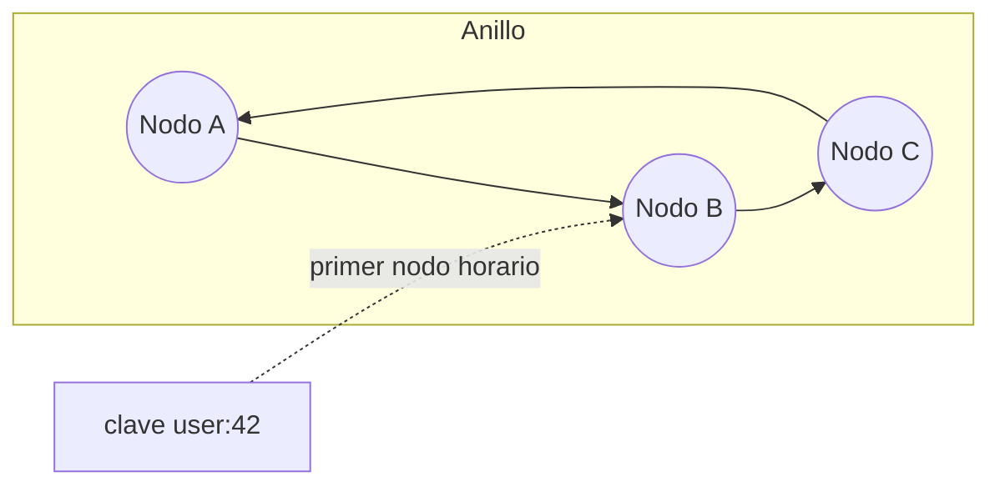
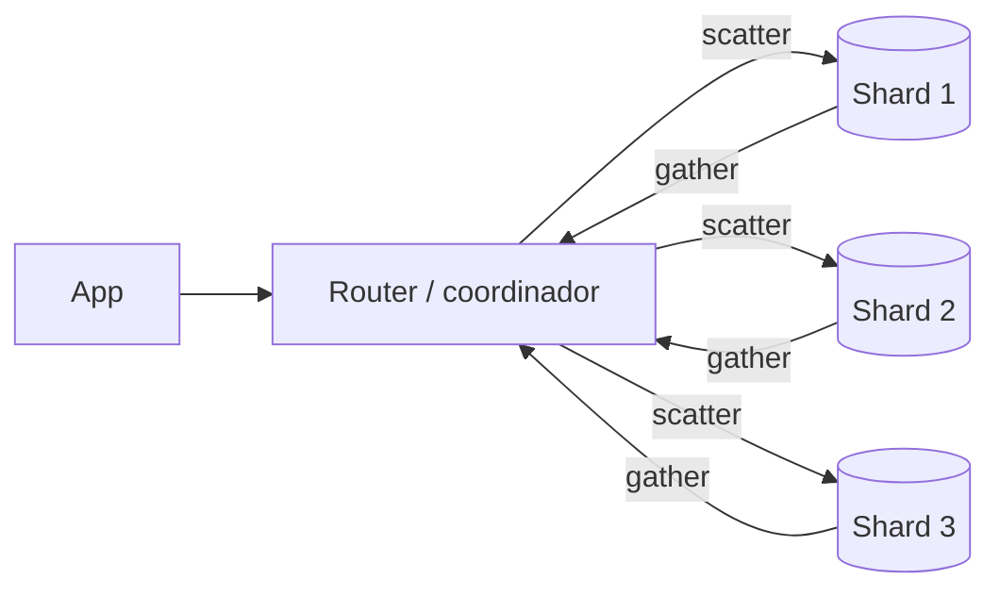

# Particionamiento y Sharding

**Sharding** es repartir los datos de una misma tabla lógica entre **varios servidores independientes**, cada uno dueño de un subconjunto (shard). Es la única forma de escalar **escrituras y almacenamiento** más allá de una máquina, y también una de las decisiones más caras e irreversibles de una arquitectura. Antes de llegar aquí, revisa [Escalabilidad.md](./Escalabilidad.md).

## Terminología: particionamiento vs sharding

| Concepto | Qué divide | Dónde viven las partes | Ejemplo |
|---|---|---|---|
| **Particionamiento vertical** | Columnas o tablas | Mismo o distinto servidor | Mover `usuarios.foto_blob` a otra tabla; separar la BD de facturación de la de catálogo |
| **Particionamiento horizontal** | Filas | **Mismo servidor** | `PARTITION BY RANGE (creado_en)` en Postgres |
| **Sharding** | Filas | **Distintos servidores** | Clientes A-M en el cluster 1, N-Z en el cluster 2 |

- El particionamiento horizontal local mejora mantenimiento y consultas sobre tablas gigantes, pero **no agrega CPU, RAM ni IOPS**.
- El sharding sí agrega capacidad, pero pierde joins, constraints y transacciones entre shards.
- Separar por dominio/microservicio (particionado vertical funcional) suele ser el primer paso "distribuido" y es mucho más barato que shardear.

## Particionamiento nativo en PostgreSQL

```sql
-- RANGE: series de tiempo, logs, eventos
CREATE TABLE eventos (
  id         bigint GENERATED ALWAYS AS IDENTITY,
  tenant_id  bigint      NOT NULL,
  tipo       text        NOT NULL,
  payload    jsonb,
  creado_en  timestamptz NOT NULL,
  PRIMARY KEY (id, creado_en)          -- la PK debe incluir la clave de partición
) PARTITION BY RANGE (creado_en);

CREATE TABLE eventos_2026_09 PARTITION OF eventos
  FOR VALUES FROM ('2026-09-01') TO ('2026-10-01');   -- límite superior exclusivo
CREATE TABLE eventos_2026_10 PARTITION OF eventos
  FOR VALUES FROM ('2026-10-01') TO ('2026-11-01');
CREATE TABLE eventos_default PARTITION OF eventos DEFAULT;  -- red de seguridad

-- Un índice en el padre se crea en todas las particiones (PG11+)
CREATE INDEX ON eventos (tenant_id, creado_en);
```

```sql
-- LIST: valores discretos (región, país, tipo)
CREATE TABLE clientes (
  id     bigint NOT NULL,
  region text   NOT NULL,
  nombre text,
  PRIMARY KEY (id, region)
) PARTITION BY LIST (region);
CREATE TABLE clientes_latam PARTITION OF clientes FOR VALUES IN ('CL', 'AR', 'PE', 'MX');
CREATE TABLE clientes_eu    PARTITION OF clientes FOR VALUES IN ('ES', 'DE', 'FR');

-- HASH: distribuir uniformemente cuando no hay un rango natural
CREATE TABLE sesiones (
  user_id bigint NOT NULL,
  token   text   NOT NULL,
  PRIMARY KEY (user_id, token)
) PARTITION BY HASH (user_id);
CREATE TABLE sesiones_p0 PARTITION OF sesiones FOR VALUES WITH (MODULUS 4, REMAINDER 0);
CREATE TABLE sesiones_p1 PARTITION OF sesiones FOR VALUES WITH (MODULUS 4, REMAINDER 1);
CREATE TABLE sesiones_p2 PARTITION OF sesiones FOR VALUES WITH (MODULUS 4, REMAINDER 2);
CREATE TABLE sesiones_p3 PARTITION OF sesiones FOR VALUES WITH (MODULUS 4, REMAINDER 3);
```

### Partition pruning

- El planner descarta particiones que no pueden contener filas según el `WHERE`. Funciona en tiempo de planificación (constantes) y de **ejecución** (parámetros de prepared statements, subconsultas).
- **Solo funciona si filtras por la clave de partición**. Una consulta por `tipo` sin `creado_en` recorre todas las particiones.

```sql
EXPLAIN SELECT count(*) FROM eventos
WHERE creado_en >= '2026-10-01' AND creado_en < '2026-10-15';
-- Solo aparece eventos_2026_10 en el plan
```

### Retención: borrar particiones viejas

```sql
-- En vez de DELETE masivo (lento, genera WAL, bloat y VACUUM):
ALTER TABLE eventos DETACH PARTITION eventos_2026_09 CONCURRENTLY;  -- PG14+, sin bloquear lecturas/escrituras
DROP TABLE eventos_2026_09;   -- instantáneo, libera disco de inmediato
```

- Automatiza la creación/eliminación con **pg_partman** + `pg_cron`. Nunca dependas de que alguien cree la partición del mes siguiente a mano.

### Límites del particionamiento nativo

- Las **PK y UNIQUE deben incluir la clave de partición**: no puedes garantizar `UNIQUE (email)` global en una tabla particionada por fecha.
- Miles de particiones degradan la planificación y los locks. Apunta a decenas o pocos cientos.
- Un `UPDATE` que cambia la clave de partición mueve la fila (DELETE + INSERT interno).
- Ver [Performance.md](./Performance.md) y [PlanesDeEjecucion.md](./PlanesDeEjecucion.md).

## Estrategias de sharding

| Estrategia | Cómo asigna el shard | Pros | Contras |
|---|---|---|---|
| **Range** | Rangos de la clave (`id` 1-1M → shard 1) | Consultas por rango eficientes; fácil de razonar | Hotspots: todas las inserciones nuevas van al último shard si la clave es creciente |
| **Hash** | `hash(key) mod N` o consistent hashing | Distribución uniforme | Los rangos se dispersan por todos los shards; con `mod N` cambiar N mueve casi todo |
| **Directory / lookup** | Tabla de mapeo `clave → shard` | Máxima flexibilidad: mover un tenant es actualizar una fila | El directorio es un componente crítico (cachearlo, replicarlo) |
| **Geo** | Región del usuario/tenant | Latencia baja, cumplimiento de residencia de datos (GDPR) | Carga desigual entre regiones; usuarios que se mudan |

- En SaaS B2B lo más habitual es **shardear por `tenant_id` con directorio**: los datos de un cliente viven juntos (joins locales) y los tenants grandes pueden ir a shards dedicados.

## Consistent hashing

Con `hash(key) % N`, pasar de 4 a 5 nodos reasigna ~80% de las claves. **Consistent hashing** ubica nodos y claves en un anillo; cada clave va al primer nodo en sentido horario. Añadir o quitar un nodo mueve solo ~`1/N` de las claves.



- **Nodos virtuales (vnodes)**: cada nodo físico ocupa muchas posiciones en el anillo. Así la carga se reparte uniformemente, un nodo nuevo toma carga de todos los demás (no solo de su vecino) y se puede ponderar por capacidad.
- Lo usan Cassandra, DynamoDB, Riak y muchos clientes de caché.

```typescript
import { createHash } from 'node:crypto';

function hash32(value: string): number {
  return createHash('md5').update(value).digest().readUInt32BE(0);
}

export class ConsistentHashRing {
  private ring: { point: number; node: string }[] = [];

  constructor(nodes: string[], private readonly vnodes = 150) {
    nodes.forEach((n) => this.addNode(n));
  }

  addNode(node: string): void {
    for (let i = 0; i < this.vnodes; i++) {
      this.ring.push({ point: hash32(`${node}#${i}`), node });
    }
    this.ring.sort((a, b) => a.point - b.point);
  }

  removeNode(node: string): void {
    this.ring = this.ring.filter((e) => e.node !== node);
  }

  getNode(key: string): string {
    if (this.ring.length === 0) throw new Error('Anillo vacío');
    const h = hash32(key);
    let lo = 0;
    let hi = this.ring.length - 1;
    if (h > this.ring[hi].point) return this.ring[0].node; // da la vuelta al anillo
    while (lo < hi) {                                     // primer punto >= h
      const mid = (lo + hi) >>> 1;
      if (this.ring[mid].point < h) lo = mid + 1;
      else hi = mid;
    }
    return this.ring[lo].node;
  }
}

const ring = new ConsistentHashRing(['shard-a', 'shard-b', 'shard-c']);
ring.getNode('tenant:1234'); // p. ej. 'shard-b'
```

- Alternativa muy usada: **N particiones lógicas fijas** (ej. 1024 slots) mapeadas a nodos físicos. Redis Cluster usa 16384 hash slots. Resharding = mover slots, no recalcular hashes.

## Elegir la shard key

Es la decisión más importante e irreversible. Criterios:

- **Cardinalidad alta**: `pais` tiene ~200 valores; no permite más de 200 shards y los grandes serán enormes.
- **Distribución uniforme** de datos y, sobre todo, de **tráfico**.
- **Patrón de acceso**: las consultas más frecuentes deben incluir la shard key para ir a **un solo shard**. Si el 90% de las queries son "pedidos del cliente X", la key es `cliente_id`, no `pedido_id`.
- **Localidad de transacciones**: lo que se modifica junto debe vivir junto (tenant y todos sus datos).
- **Inmutabilidad**: cambiar la shard key de una fila implica moverla entre servidores.

| Candidata | Problema |
|---|---|
| `created_at` | Todas las escrituras al shard "actual" (hotspot) |
| `id` autoincremental con range | Igual que arriba |
| `pais` | Baja cardinalidad y distribución muy desigual |
| `user_id` hash | Bueno para B2C; malo si se consulta mucho "por fecha global" |
| `tenant_id` | Bueno para SaaS; tenants gigantes crean hot partitions |

### Hot keys y hot partitions

- **Celebridad / tenant gigante**: un solo valor de la clave concentra el tráfico.
- Soluciones:
  - **Aislar**: mover el tenant grande a un shard dedicado (fácil con directorio).
  - **Salting / write sharding**: añadir un sufijo aleatorio `clave#0..9` para repartir escrituras; las lecturas deben consultar los 10 sufijos y agregar. Patrón típico en DynamoDB.
  - **Clave compuesta**: `(tenant_id, user_id)` en vez de solo `tenant_id`.
  - **Caché** delante para hot keys de lectura. Ver [Caching.md](./Caching.md).
  - **Buffer y agregación**: contadores en Redis y flush periódico en vez de `UPDATE contador + 1` en la misma fila.

## Consultas cross-shard



- **Scatter-gather**: la consulta sin shard key va a todos los shards y se combina. La latencia es la del shard **más lento** (tail latency) y la carga se multiplica por N.
- **Agregaciones**: `COUNT`/`SUM` se suman; `AVG` requiere sumar `SUM` y `COUNT` por separado; `ORDER BY ... LIMIT 10` requiere pedir 10 a cada shard y re-ordenar; la paginación profunda con `OFFSET` es inviable (usar keyset pagination).
- **Joins**:
  - **Co-location**: shardear tablas relacionadas por la misma clave (`pedidos` e `items` por `cliente_id`) para que el join sea local.
  - **Reference tables**: tablas pequeñas (países, planes) replicadas completas en cada shard.
  - Si no, join en la aplicación o en un sistema analítico.
- **Transacciones cross-shard**: evítalas por diseño. Si son inevitables: 2PC (lento, bloqueante) o sagas. Ver [TransaccionesDistribuidas.md](./TransaccionesDistribuidas.md).
- **Unicidad global** (`email` único): una tabla/servicio de unicidad aparte, o shardear esa tabla por el propio email.
- Reporting global: replicar todos los shards vía CDC a un warehouse. Ver [OLTPvsOLAP.md](./OLTPvsOLAP.md) y [OutboxCDC.md](./OutboxCDC.md).

## IDs globales

Los `SERIAL` por shard colisionan. Opciones:

| Opción | Tamaño | Ordenable por tiempo | Coordinación | Nota |
|---|---|---|---|---|
| UUIDv4 | 128 bits | No | Ninguna | Aleatorio: fragmenta índices B-tree, peor localidad en inserts |
| **UUIDv7** | 128 bits | Sí (48 bits de timestamp en ms) | Ninguna | Estándar RFC 9562; `uuidv7()` nativo en PostgreSQL 18 |
| **Snowflake** | 64 bits | Sí | Asignar un worker ID único por nodo | 41 bits timestamp + 10 bits máquina + 12 bits secuencia (~4096 IDs/ms por nodo) |
| Rangos por shard / secuencia con paso | 64 bits | Parcial | Configuración | `INCREMENT BY 16 START n`; frágil al añadir shards |

- Preferencia moderna: **UUIDv7** si 128 bits no es problema; Snowflake si necesitas `bigint`. Los relojes que retroceden son el riesgo de ambos: el generador debe detectarlo.
- Es útil **codificar el shard en el ID** (o en el directorio) para enrutar sin lookup adicional.

## Resharding

Tarde o temprano un shard se llena o se calienta. Pasos típicos de un resharding online:

1. Crear el shard destino.
2. **Copiar** el snapshot de los datos a mover.
3. **Replicar cambios** en curso (CDC / replicación lógica / VReplication).
4. Verificar consistencia (checksums, conteos).
5. **Cortar**: pausar brevemente escrituras de esas claves, esperar que el lag llegue a cero, actualizar el directorio/router.
6. Limpiar los datos del shard origen.

- Diseñar con **muchas particiones lógicas desde el inicio** (ej. 4096) sobre pocos nodos hace que el resharding sea mover particiones enteras, no dividir datos fila a fila.
- Herramientas que lo automatizan: Vitess (`Reshard` con VReplication), Citus (`rebalance_table_shards`), MongoDB (balancer de chunks, `reshardCollection` desde 5.0), DynamoDB (split automático de particiones).

## Herramientas

| Herramienta | Modelo | Puntos clave |
|---|---|---|
| **Citus** (Postgres) | Extensión; coordinador + workers | `create_distributed_table('pedidos', 'tenant_id')`, reference tables, co-location, SQL casi completo |
| **Vitess** (MySQL) | Proxy `vtgate` + `vttablet` | Vindexes para enrutar, resharding online, usado por YouTube, Slack, PlanetScale |
| **MongoDB sharding** | `mongos` + config servers + shards | `sh.shardCollection("app.pedidos", { clienteId: "hashed" })`; chunks balanceados automáticamente |
| **DynamoDB** | Totalmente gestionado | La partition key *es* la shard key; adaptive capacity mitiga hot partitions, pero el diseño de la key sigue mandando |
| **NewSQL** (CockroachDB, YugabyteDB, Spanner, TiDB) | Sharding automático por rangos + consenso Raft/Paxos | Transacciones distribuidas ACID; mayor latencia por escritura. Ver [Escalabilidad.md](./Escalabilidad.md) |

```sql
-- Citus: distribuir por tenant y co-localizar
SELECT create_distributed_table('pedidos', 'tenant_id');
SELECT create_distributed_table('items_pedido', 'tenant_id', colocate_with => 'pedidos');
SELECT create_reference_table('paises');
```

## Cuándo NO shardear

Shardear multiplica la complejidad operativa (backups, migraciones, monitoreo por shard) y de desarrollo (cada query debe pensar en la shard key). Agota antes:

1. Optimizar queries e índices. Ver [Indices.md](./Indices.md).
2. Connection pooling. Ver [ConnectionPooling.md](./ConnectionPooling.md).
3. Caché. Ver [Caching.md](./Caching.md).
4. Réplicas de lectura, si el problema es de lectura. Ver [ReadReplicas.md](./ReadReplicas.md).
5. **Escalado vertical**: hoy existen instancias con cientos de vCPU y TBs de RAM; suele ser lo más barato en tiempo de ingeniería.
6. Particionamiento nativo y archivado de datos fríos.
7. Separar por dominio (cada servicio su BD).

Señales de que sí toca: el volumen de **escrituras** satura la instancia más grande razonable, el dataset caliente no cabe en RAM, el tiempo de backup/restore o de VACUUM se vuelve inaceptable, o requisitos de residencia de datos por región.

## Preguntas de entrevista

1. **¿Diferencia entre particionamiento y sharding?**
   El particionamiento divide una tabla dentro del mismo servidor (mantenimiento, pruning); el sharding reparte los datos entre servidores para agregar capacidad, a costa de joins y transacciones entre nodos.
2. **¿Cómo eliges la shard key de un SaaS multi-tenant?**
   `tenant_id`: alta cardinalidad, casi todas las consultas lo incluyen y las transacciones quedan dentro de un shard. Con directorio para aislar tenants gigantes.
3. **¿Por qué no `created_at` como shard key?**
   Todas las escrituras nuevas caen en el mismo shard (hotspot) mientras los demás están ociosos.
4. **¿Qué resuelven los nodos virtuales?**
   La distribución desigual del anillo y que un nodo nuevo solo alivie a su vecino. Con muchos vnodes la carga se reparte y se puede ponderar por capacidad.
5. **¿Cómo haces `ORDER BY created_at LIMIT 20` sobre 16 shards?**
   Pedir 20 a cada shard con el mismo orden, mezclar y quedarse con 20; para páginas siguientes, keyset pagination con el último valor visto, nunca OFFSET profundo.
6. **¿Cómo garantizas unicidad de email si shardeas usuarios por `user_id`?**
   Una tabla de unicidad separada shardeada por email (o un servicio), insertada antes o en la misma saga, con constraint UNIQUE local.
7. **¿UUIDv4 o UUIDv7 como PK?**
   UUIDv7: generado sin coordinación y ordenado por tiempo, así las inserciones son casi secuenciales en el B-tree y no lo fragmentan.
8. **¿Cómo borras 2 años de logs de una tabla de 5 TB?**
   Si está particionada por fecha, `DETACH PARTITION ... CONCURRENTLY` y `DROP TABLE`. Si no, lotes pequeños de DELETE con pausas, y particionar hacia adelante.

## Errores comunes

- Shardear prematuramente con una sola instancia de 4 vCPU sin índices adecuados.
- Elegir la shard key por el modelo de datos y no por el patrón de acceso.
- Usar `hash % N` y descubrir al añadir un nodo que hay que mover casi todo.
- Consultas sin la shard key en el camino crítico (scatter-gather en cada request).
- Particionar en Postgres y esperar que `UNIQUE (email)` siga funcionando globalmente.
- Particiones sin automatización: el día 1 del mes los inserts caen en la default o fallan.
- IDs autoincrementales por shard que colisionan al consolidar datos.
