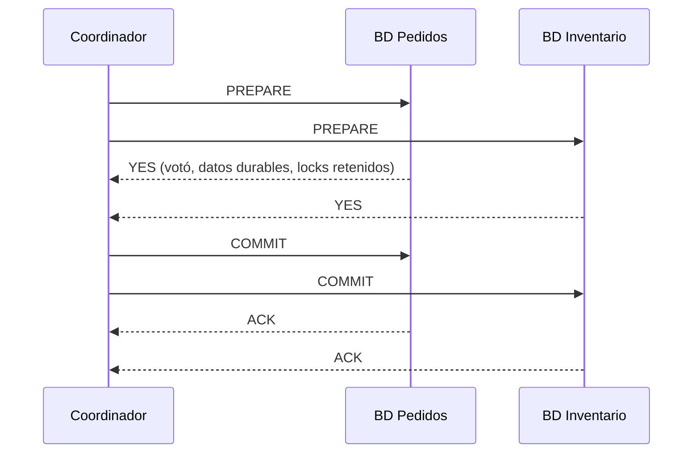
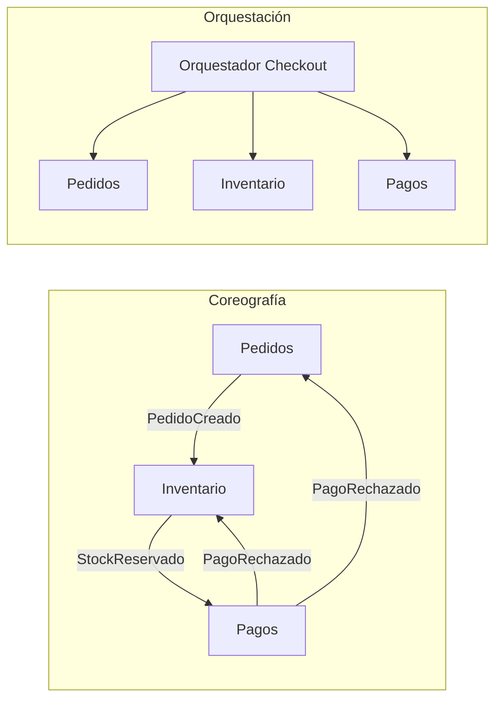

# Transacciones distribuidas

Una transacción distribuida intenta que una operación de negocio que toca **varias bases de datos o servicios** sea atómica: todo o nada. En un monolito con una sola BD esto es un `BEGIN ... COMMIT` (ver [Transacciones.md](./Transacciones.md)). En microservicios **no existe ese lujo**, y elegir cómo manejarlo define la confiabilidad del sistema.

## Por qué no hay ACID entre servicios

- Cada servicio tiene **su propia BD** (database-per-service); ninguna BD puede hacer rollback de los cambios de otra.
- La red es poco confiable: un timeout **no dice** si la operación remota se ejecutó o no.
- Bloquear recursos en varios servicios mientras se espera a todos reduce disponibilidad: si uno cae, todos esperan (ver [CAP.md](./CAP.md)).
- Muchos participantes ni siquiera soportan transacciones: un broker, una API de pagos, un email enviado.

Opciones reales:

| Enfoque | Consistencia | Disponibilidad | Complejidad | Uso |
|---|---|---|---|---|
| **2PC / XA** | Atómica (fuerte) | Baja: bloqueante | Media, en infraestructura | Pocas BDs homogéneas en la misma red |
| **Saga** | Eventual, con compensaciones | Alta | Alta, en la aplicación | Microservicios, procesos de negocio largos |
| **Evitar la distribución** | ACID local | Alta | Baja | Rediseñar límites para que lo atómico viva en un servicio |

- La primera pregunta senior: **¿realmente necesito esta transacción distribuida o los límites del servicio están mal trazados?**

## Two-Phase Commit (2PC)



- **Fase 1 (prepare/votación)**: el coordinador pide a cada participante que prepare la transacción. Quien vota YES garantiza que podrá hacer commit incluso tras un crash (escribe todo a disco) y **mantiene los locks**.
- **Fase 2 (commit/abort)**: si todos votaron YES, el coordinador registra la decisión y ordena COMMIT; si alguno votó NO o no respondió, ordena ABORT.
- **El problema**: si el coordinador cae después de que todos votaron YES y antes de comunicar la decisión, los participantes quedan **in-doubt**: no pueden hacer commit ni abort por su cuenta y retienen los locks hasta que el coordinador vuelva. 2PC es un protocolo **bloqueante**.
- **XA** es el estándar (X/Open) para 2PC entre gestores de recursos (BDs, brokers JMS). Soportado por Postgres, MySQL, Oracle; poco usado en el ecosistema Node.
- **3PC** agrega una fase de pre-commit para no bloquear ante la caída del coordinador, pero asume una red con retardos acotados y no tolera particiones; prácticamente no se usa. En su lugar, sistemas como Spanner o CockroachDB hacen **2PC sobre grupos replicados con consenso (Paxos/Raft)**: el coordinador no es un punto único de falla.

```sql
-- 2PC manual en PostgreSQL (requiere max_prepared_transactions > 0)
BEGIN;
UPDATE inventario SET stock = stock - 1 WHERE sku = 'ABC';
PREPARE TRANSACTION 'pedido-9f1c';       -- fase 1: la tx sobrevive a reinicios

-- fase 2, decidida por el coordinador:
COMMIT PREPARED 'pedido-9f1c';           -- o ROLLBACK PREPARED 'pedido-9f1c';

-- Transacciones huérfanas: retienen locks y bloquean VACUUM
SELECT gid, prepared, owner FROM pg_prepared_xacts;
```

- **Cuándo NO usar 2PC**: entre microservicios por HTTP, con participantes que no soportan prepare (APIs externas, brokers en general), o cuando la latencia/disponibilidad importa más que la atomicidad inmediata.

## Saga

Una **saga** es una secuencia de **transacciones locales**; cada una confirma en su propia BD y tiene una **compensación** que deshace semánticamente su efecto si un paso posterior falla.

- Compensar ≠ rollback: el efecto intermedio **fue visible** (se reservó stock, se cobró). La compensación es una nueva acción de negocio (liberar stock, reembolsar), no un borrado mágico.
- La saga proporciona ACD, pero **no aislamiento (I)**: otras operaciones pueden ver estados intermedios. Esto se mitiga con contramedidas (ver más abajo).

### Tipos de pasos y pivot transaction

- **Compensables**: pasos antes del punto de no retorno; tienen compensación.
- **Pivot transaction**: el paso que, si tiene éxito, compromete a la saga a terminar (ej. el cobro efectivo). Si falla, se compensa lo anterior.
- **Reintentables (retriable)**: pasos después del pivot; no se compensan, **se reintentan hasta que funcionen** (deben ser idempotentes). Ej.: enviar email de confirmación, crear el envío.
- Diseña el orden para que los pasos más propensos a fallar (validaciones, reservas) vayan antes del pivot.

### Coreografía vs orquestación



| | Coreografía | Orquestación |
|---|---|---|
| Control | Cada servicio reacciona a eventos | Un orquestador decide el siguiente paso |
| Acoplamiento | Bajo entre servicios, pero el flujo está implícito | Los servicios no se conocen; el orquestador los conoce a todos |
| Visibilidad | Difícil saber "en qué estado está el pedido" | Estado explícito y persistido |
| Cuándo | 2-4 pasos simples | Flujos largos, con ramas, timeouts y compensaciones |
| Riesgo | Ciclos de eventos, lógica dispersa | El orquestador como "god service" |

### Orquestación en TypeScript

Puntos clave: **compensar solo los pasos que completaron, en orden inverso**, y persistir el estado de la saga para poder retomarla si el proceso muere.

```typescript
interface SagaStep<C> {
  name: string;
  execute: (ctx: C) => Promise<void>;
  compensate?: (ctx: C) => Promise<void>; // sin compensate = paso reintentable post-pivot
}

interface SagaLog {
  markCompleted(sagaId: string, step: string): Promise<void>;
  markCompensated(sagaId: string, step: string): Promise<void>;
  markFailed(sagaId: string, reason: string): Promise<void>;
}

export class SagaOrchestrator<C extends { sagaId: string }> {
  constructor(private readonly steps: SagaStep<C>[], private readonly log: SagaLog) {}

  async run(ctx: C): Promise<void> {
    const completed: SagaStep<C>[] = [];

    for (const step of this.steps) {
      try {
        await step.execute(ctx);
        completed.push(step);
        await this.log.markCompleted(ctx.sagaId, step.name);
      } catch (err) {
        await this.compensate(ctx, completed);
        await this.log.markFailed(ctx.sagaId, `${step.name}: ${(err as Error).message}`);
        throw err;
      }
    }
  }

  private async compensate(ctx: C, completed: SagaStep<C>[]): Promise<void> {
    // Orden inverso: se deshace primero lo último que se hizo
    for (const step of [...completed].reverse()) {
      if (!step.compensate) continue;
      await retry(() => step.compensate!(ctx)); // una compensación no puede "fallar": se reintenta
      await this.log.markCompensated(ctx.sagaId, step.name);
    }
  }
}

async function retry<T>(fn: () => Promise<T>, attempts = 5, baseMs = 200): Promise<T> {
  for (let i = 0; ; i++) {
    try {
      return await fn();
    } catch (err) {
      if (i >= attempts - 1) throw err; // agotado: alerta y resolución manual (dead letter)
      await new Promise((r) => setTimeout(r, baseMs * 2 ** i));
    }
  }
}

// Uso: checkout
interface CheckoutCtx { sagaId: string; pedidoId: string; clienteId: string; total: number }

const checkout = new SagaOrchestrator<CheckoutCtx>([
  { name: 'crearPedido',   execute: (c) => pedidos.crearPendiente(c),  compensate: (c) => pedidos.cancelar(c) },
  { name: 'reservarStock', execute: (c) => inventario.reservar(c),     compensate: (c) => inventario.liberar(c) },
  { name: 'cobrar',        execute: (c) => pagos.cobrar(c),            compensate: (c) => pagos.reembolsar(c) }, // pivot
  { name: 'confirmar',     execute: (c) => pedidos.confirmar(c) },      // reintentable
  { name: 'crearEnvio',    execute: (c) => envios.crear(c) },           // reintentable
], sagaLog);
```

- Matiz importante: si `execute` falla por **timeout**, el paso pudo haberse aplicado en el servicio remoto. Por eso las compensaciones deben tolerar "no hay nada que compensar" y los servicios deben aceptar la compensación aunque llegue antes que la acción (guardando un registro de "cancelado" para rechazar la acción tardía). Algunos equipos registran la compensación **antes** de ejecutar el paso por esta razón.
- Este orquestador en memoria es didáctico: si el proceso muere a mitad, la saga queda colgada. En producción se usa un motor durable.

### Coreografía en TypeScript

```typescript
// Servicio de inventario: reacciona a eventos, publica los suyos vía outbox
bus.on('PedidoCreado', async (evt: { eventId: string; pedidoId: string; items: Item[] }) => {
  await db.tx(async (tx) => {
    if (!(await marcarProcesado(tx, 'inventario', evt.eventId))) return; // duplicado
    const ok = await reservarStock(tx, evt.pedidoId, evt.items);
    await insertarOutbox(tx, ok
      ? { type: 'StockReservado', pedidoId: evt.pedidoId }
      : { type: 'StockInsuficiente', pedidoId: evt.pedidoId });
  });
});

bus.on('PagoRechazado', async (evt: { eventId: string; pedidoId: string }) => {
  await db.tx(async (tx) => {
    if (!(await marcarProcesado(tx, 'inventario', evt.eventId))) return;
    await liberarStock(tx, evt.pedidoId); // compensación idempotente
  });
});
```

- Publicar el evento **en la misma transacción** que el cambio de estado requiere el patrón outbox; escribir en la BD y luego publicar en el broker es el **dual-write problem**. Ver [OutboxCDC.md](./OutboxCDC.md).

### Contramedidas por falta de aislamiento

- **Semantic lock / estados pendientes**: el pedido nace como `PENDIENTE_PAGO`, no como `CONFIRMADO`. Otras operaciones ven el estado y actúan en consecuencia (no se despacha un pedido pendiente).
- **Reservas en vez de descuentos directos**: `stock_reservado` separado de `stock_disponible`, con expiración.
- **Valores conmutativos**: operaciones que se pueden aplicar en cualquier orden (`saldo = saldo + x`) en vez de `saldo = valorLeido`.
- **Re-leer valores** antes de actuar (versión optimista) y **reordenar pasos** para que los riesgosos vayan antes del pivot.

```sql
CREATE TYPE estado_pedido AS ENUM
  ('PENDIENTE_PAGO', 'CONFIRMADO', 'CANCELADO', 'ENVIADO');

-- Transición protegida: solo se confirma desde el estado esperado
UPDATE pedidos SET estado = 'CONFIRMADO', version = version + 1
WHERE id = $1 AND estado = 'PENDIENTE_PAGO';
-- 0 filas afectadas => ya fue cancelado o confirmado: no hacer nada
```

### Compensaciones idempotentes

- Toda compensación puede ejecutarse **más de una vez** (reintentos, mensajes duplicados) y debe producir el mismo resultado.
- Implementación típica: transiciones de estado condicionales (`WHERE estado = 'RESERVADO'`) o registrar la compensación con clave única.
- Una compensación **no puede fallar definitivamente**: se reintenta con backoff y, si se agota, va a una cola de revisión manual con alerta.

## Herramientas

| Herramienta | Modelo | Notas |
|---|---|---|
| **Temporal** (o Cadence) | Workflows como código, estado durable por event sourcing | Reintentos, timeouts y compensaciones declarados en TypeScript; el workflow sobrevive a reinicios |
| **AWS Step Functions** | Máquina de estados en JSON (ASL) | `Catch` y `Retry` por estado; integración nativa con Lambda, DynamoDB, SQS |
| Camunda / Zeebe | BPMN | Procesos de negocio visibles para negocio |
| Orquestador propio | Tabla `sagas` + worker | Solo si el volumen de sagas es pequeño y no quieres dependencia |

```typescript
// Temporal: el workflow es código determinista; las actividades hacen I/O
import { proxyActivities } from '@temporalio/workflow';
import type * as acts from './activities';

const { crearPedido, cancelarPedido, reservarStock, liberarStock, cobrar, reembolsar, crearEnvio } =
  proxyActivities<typeof acts>({ startToCloseTimeout: '30s', retry: { maximumAttempts: 5 } });

export async function checkoutWorkflow(p: { pedidoId: string; total: number }): Promise<void> {
  const compensaciones: Array<() => Promise<void>> = [];
  try {
    await crearPedido(p);   compensaciones.unshift(() => cancelarPedido(p));
    await reservarStock(p); compensaciones.unshift(() => liberarStock(p));
    await cobrar(p);        compensaciones.unshift(() => reembolsar(p));
  } catch (err) {
    for (const compensar of compensaciones) await compensar(); // ya en orden inverso
    throw err;
  }
  await crearEnvio(p); // post-pivot: Temporal lo reintenta según la política
}
```

## Idempotencia bien hecha

Con reintentos, timeouts y brokers **at-least-once**, toda operación que cambia estado recibirá duplicados. Un `Set` en memoria no sirve: se pierde al reiniciar, no se comparte entre instancias y tiene condiciones de carrera. La idempotencia vive **en la base de datos**, con un **UNIQUE constraint**.

### Idempotency key en una API

El cliente envía `Idempotency-Key: <uuid>` y el servidor guarda la clave **en la misma transacción** que el efecto.

```sql
CREATE TABLE idempotency_keys (
  key           text        PRIMARY KEY,
  request_hash  text        NOT NULL,          -- detecta la misma key con otro body
  response_code int         NOT NULL,
  response_body jsonb       NOT NULL,
  created_at    timestamptz NOT NULL DEFAULT now()
);
-- Limpieza periódica: DELETE ... WHERE created_at < now() - interval '7 days'
```

```typescript
import { Pool } from 'pg';
import { createHash } from 'node:crypto';

const pool = new Pool();

export async function crearPago(idemKey: string, body: { pedidoId: string; monto: number }) {
  const requestHash = createHash('sha256').update(JSON.stringify(body)).digest('hex');
  const client = await pool.connect();
  try {
    await client.query('BEGIN');

    // Reserva la key. Si otra request concurrente con la misma key está en curso,
    // este INSERT espera en el índice único hasta que aquella haga COMMIT o ROLLBACK.
    const inserted = await client.query(
      `INSERT INTO idempotency_keys (key, request_hash, response_code, response_body)
       VALUES ($1, $2, 0, '{}') ON CONFLICT (key) DO NOTHING RETURNING key`,
      [idemKey, requestHash]);

    if (inserted.rowCount === 0) {
      await client.query('ROLLBACK');
      const { rows } = await pool.query(
        'SELECT request_hash, response_code, response_body FROM idempotency_keys WHERE key = $1',
        [idemKey]);
      if (rows[0].request_hash !== requestHash) {
        return { status: 422, body: { error: 'Idempotency-Key reutilizada con otro payload' } };
      }
      return { status: rows[0].response_code, body: rows[0].response_body }; // replay
    }

    const { rows } = await client.query(
      `INSERT INTO pagos (pedido_id, monto, estado) VALUES ($1, $2, 'APROBADO') RETURNING id`,
      [body.pedidoId, body.monto]);
    const response = { pagoId: rows[0].id };

    await client.query(
      'UPDATE idempotency_keys SET response_code = 201, response_body = $2 WHERE key = $1',
      [idemKey, response]);
    await client.query('COMMIT');   // efecto y key se confirman juntos, o ninguno
    return { status: 201, body: response };
  } catch (err) {
    await client.query('ROLLBACK');
    throw err;
  } finally {
    client.release();
  }
}
```

- Si el efecto incluye una **llamada externa** (pasarela de pago), no cabe en la transacción local: se guarda la key con estado `EN_PROCESO`, se llama al proveedor **pasándole la misma idempotency key** (Stripe y la mayoría lo soportan), y se actualiza a `COMPLETADO`. Una request que encuentra `EN_PROCESO` responde 409 o espera.

### Consumidor idempotente

```sql
CREATE TABLE mensajes_procesados (
  consumidor   text        NOT NULL,
  mensaje_id   uuid        NOT NULL,
  procesado_en timestamptz NOT NULL DEFAULT now(),
  PRIMARY KEY (consumidor, mensaje_id)
);
```

```typescript
// Devuelve false si el mensaje ya se procesó. Debe ejecutarse dentro de la misma tx que el efecto.
async function marcarProcesado(tx: PoolClient, consumidor: string, mensajeId: string): Promise<boolean> {
  const r = await tx.query(
    `INSERT INTO mensajes_procesados (consumidor, mensaje_id) VALUES ($1, $2)
     ON CONFLICT DO NOTHING`, [consumidor, mensajeId]);
  return r.rowCount === 1;
}
```

- **At-least-once + consumidor idempotente = efectivamente exactly-once** (en el efecto). La entrega exactly-once "pura" no existe en sistemas distribuidos; lo que se logra es **procesamiento** exactly-once.
- El ACK al broker se envía **después** del COMMIT. Si el proceso muere entre ambos, el mensaje se reentrega y la tabla lo descarta.
- También sirve la idempotencia natural: `UPSERT` por clave de negocio, `UPDATE ... WHERE estado = 'X'`, `SET valor = Y` en vez de `valor = valor + 1`.

## Consistencia eventual

- Tras una saga o un evento, los servicios **convergen** al mismo estado después de un tiempo, no inmediatamente.
- Consecuencias de diseño:
  - La UI debe expresar estados intermedios ("Procesando pago...") en lugar de fingir inmediatez.
  - Los consumidores deben tolerar **mensajes desordenados** (usar versión o timestamp del agregado y descartar los viejos) y **duplicados**.
  - Hay que medir el **lag de convergencia** y tener procesos de **reconciliación** (jobs que comparan estados entre servicios y corrigen).
- No todo puede ser eventual: el saldo que evita un sobregiro o el stock de la última unidad requieren una decisión fuerte **en un solo lugar** (el dueño del dato). Ver [CAP.md](./CAP.md).

## Preguntas de entrevista

1. **¿Por qué 2PC es bloqueante?**
   Tras votar YES, un participante no puede decidir solo; si el coordinador cae antes de comunicar la decisión, queda in-doubt con los locks tomados hasta que vuelva.
2. **Saga: ¿qué compensas si falla el paso 3 de 5?**
   Solo los pasos 1 y 2 que completaron, en orden inverso (2 y luego 1), con compensaciones idempotentes y reintentadas. El paso 3 debe tolerar una compensación aunque su estado real sea incierto.
3. **¿Qué es la pivot transaction?**
   El punto de no retorno: antes, los pasos son compensables; después, solo reintentables. Si el pivot tiene éxito la saga debe completarse.
4. **¿Qué propiedad ACID pierde una saga y cómo lo mitigas?**
   El aislamiento. Con semantic locks (estados `PENDIENTE`), reservas, operaciones conmutativas y re-lectura con versión.
5. **¿Coreografía u orquestación para un checkout de 6 pasos con timeouts?**
   Orquestación, idealmente con un motor durable (Temporal, Step Functions): estado explícito, reintentos y compensaciones centralizados, fácil de observar.
6. **¿Cómo implementas idempotencia en un endpoint de pagos?**
   Idempotency key del cliente guardada con UNIQUE en la misma transacción que el efecto (`INSERT ... ON CONFLICT DO NOTHING`), respuesta almacenada para replay y hash del request para detectar abuso de la key.
7. **¿Existe exactly-once?**
   No en la entrega. Se logra el efecto exactly-once combinando entrega at-least-once con consumidores idempotentes que registran el ID procesado en la misma transacción.
8. **¿Qué es el dual-write problem?**
   Escribir en la BD y publicar en el broker como dos operaciones separadas: si falla una, quedan inconsistentes. Se resuelve con outbox o CDC ([OutboxCDC.md](./OutboxCDC.md)).

## Errores comunes

- Compensar todos los pasos (incluidos los no ejecutados) o en el orden en que se ejecutaron.
- Compensaciones no idempotentes que reembolsan dos veces.
- Guardar idempotency keys en memoria o en Redis sin atomicidad con el efecto.
- Registrar la key en una transacción y ejecutar el efecto en otra.
- Hacer ACK del mensaje antes de confirmar la transacción.
- Usar 2PC entre microservicios por HTTP, o dejar prepared transactions huérfanas en Postgres.
- Tratar un timeout como "falló" y reintentar sin idempotencia.
- Diseñar sagas cuando mover la frontera del servicio haría la operación local y ACID.
